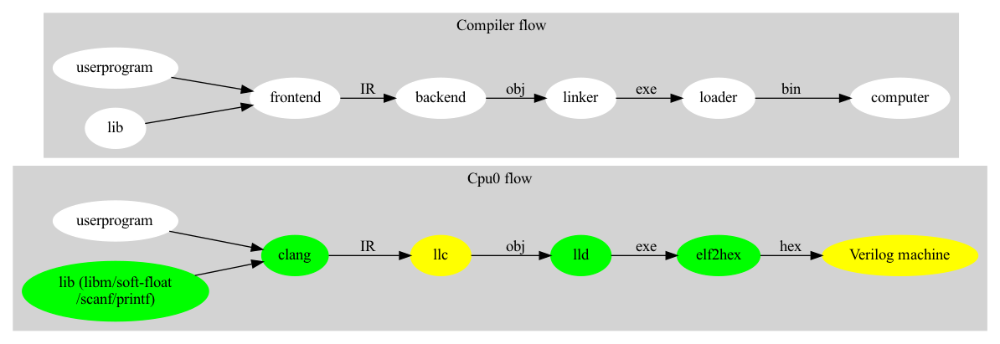

.. _sec-about:

About
======

.. contents::
   :local:
   :depth: 4

Authors
-------

.. image:: ../Fig/Author_ChineseName.png
   :align: right

Chen Chung-Shu

gamma_chen@yahoo.com.tw

http://jonathan2251.github.io/web/index.html

Acknowledgments
---------------

I would like to thank Sean Silva, chisophugis@gmail.com, for his help, 
encouragement, and assistance with the Sphinx document generator.  
Without his help, this book would not have been finished and published online. 
Also thanking those corrections from readers who make the book more accurate.

Build steps
-----------

https://github.com/Jonathan2251/lbt/blob/master/README.md

Revision history
----------------

Version 12.0.17, not released yet.

Version 12.0.16, Released May 24, 2026.

  Chatgpt: Refine my English for the input rst format texts I input the 
  following and output rst format with <= 80 characters each line.

Version 12.0.15, skip.

  Skip for syncing same version with lbd.

Version 12.0.14, Released December 30, 2023.

  libclc.
  opt.rst: llvm-link.gv.
  Add caption for reference of .gv.
  lib.rst: compiler-rt-dep.gv, compiler-rt-dep-short.gv.
  lib.rst: 16-bit a*b calculation.

Version 12.0.13, Released July 15, 2023.

  riscv.rst: AnLLVMBasedNPUCompiler.key.

Version 12.0.12, Released April 4, 2023.

  riscv.rst: The advantage of RISCV little endians.

Version 12.0.11, Released Feburary 27, 2023.

  riscv.rst: section Linker Command.
  pocl.rst, riscv.rst: books and document.
  some example-code on exlbt/riscv/.
  loop-convert2, Rewriter and PrintFunction in exlbt/clang-tools.

Version 12.0.10, Release November 13, 2022.

  clang.rst:section Builtin functions.
  lib.rst:section Compiler-rt's builtins.
  pocl.rst.
  riscv.rst:table:: RISCV toolchain, sections Mem and Resources.

Version 12.0.9, Release September 24, 2022.

  GDB section and refine Makefile bash

Version 12.0.8, Release September 8, 2022.

  Appendix A: add sections ISA and RISCV Calling Convention.
  Add Appendix B: Clang-tools.

Version 12.0.7, Release August 16, 2022.

  Appendix A: RISCV

Version 12.0.6, Released February 3, 2022.

  scanf and printf.

Version 12.0.5, Released February 1, 2022.

  Newlib/libm and complex type test for builtins-test.

Version 12.0.4, Released January 22, 2022.

  sanitizer-printf for supporting printf("%lld") or "%llX", ..., etc.
  Pass test cases in compiler-rt-test/builtins/Unit include type float and double
  exclude complex.

Version 12.0.3, Released January 9, 2022.

  Expand memory size of cpu0.v to 0x1000000, 24-bit.
  Add all compiler-rt-test/builtins/Unit/\*.c.
  
Version 12.0.2, Release December 18, 2021.
  
  Replace bash with Makefile.
  Add builtins-cpu0.c for clang regression test.

Version 12.0.1, Release December 12, 2021.

  Add target Cpu0 to clang

Version 12.0.0, Release Auguest 11, 2021.

Version 3.9.1, Released April 29, 2020

  Enable tailcall test option in build-slinker.sh

Version 3.9.0, Released November 22, 2016

  Porting to llvm 3.9.

Version 3.7.4, Released September 22, 2016

  Split elf2hex-dlinker.cpp from elf2hex.cpp in exlbt/elf2hex.

Version 3.7.3, Released July 20, 2016

  Refine code-block according sphinx lexers.
  Add search this book.
  
Version 3.7.2, Released June 29, 2016

  Dynamic linker change display from ret \$t9 to jr \$t9.
  Move llvm-objdump -elf2hex to elf2hex.
  Upgrade sphinx to 1.4.4.

Version 3.7.1, Released November 7, 2015

  Remove EM_CPU0_EL.
  Add IR blockaddress and indirectbr support.
  Add ch_9_3_detect_exception.cpp test.
  Change display "ret $rx" to "jr $rx" where $rx is not $lr.
  Add Phi node test.

Version 3.7.0, Released September 24, 2015

  Porting to lld 3.7.

Version 3.6.2, Released May 4, 2015

  Move some test from lbt to lbd.
  Remove warning in build Cpu0 code.

Version 3.6.1, Released March 22, 2015
  Correct typing.

Version 3.6.0, Released March 8, 2015
  Porting to lld 3.6.

Licensing
---------

http://llvm.org/docs/DeveloperPolicy.html#license

Outline of Chapters
-------------------

.. _about-f1: 

  Code generation and execution flow

The upper half of :numref:`about-f1` is the work flow and software package 
of a computer program be generated and executed. IR stands for Intermediate 
Representation. 
The lower half is this book's work flow and software package of the toolchain 
extended implementation based on llvm. Except clang, the other blocks need to 
be extended for a new backend development. This book implement the green boxes
part.
The Cpu0 llvm backend can be find on 
http://jonathan2251.github.io/lbd/index.html.

.. table:: Toolchain components [#toolchain]_ [#toolchain2]_

  ==============  ==========================  =============
  Component       LLVM                        GNU [#gnu]_
  ==============  ==========================  =============
  C/C++ Compiler  clang/llvm                  gcc
  Assembler       llvm integrated assembler   as
  Linker          ld.lld                      ld.bfd ld.gold
  Runtime         compiler-rt                 libgcc [#libgcc]_
  Unwinder        libunwind                   libgcc_s
  C++ library     libc++abi, libc++           libsupc++ libstdc++
  Utils           llvm-ar, llvm-objdump etc.  ar, objdump etc.
  C library                  -                libc
  ==============  ==========================  =============

The libgcc's Integer plus Soft float library [#libgcc]_ [#integer-lib]_ 
[#soft-float-lib]_ are equal to functions of compiler-rt's builtins.

This book include:

1. Add Cpu0 target to clang.
2. The elf2hex extended from llvm-objump. Chapter 3.
3. Optimization. Chapter 4.
4. Porting C standard library from avr libc and software floating point library
   from LLVM compiler-rt.

With these implementation, reader can generate Cpu0 machine code through Cpu0 
llvm backend compiler, linker and elf2hex, then see how it runs on your 
computer. 

:ref:`sec-clang`:

Add Cpu0 target to clang.

:ref:`sec-lld`:

Develop ELF linker for Cpu0 backend based on lld project.  

:ref:`sec-opt`:

Backend independent optimaization.

:ref:`sec-lib`:

Software floating point library and standard C library supporting.

.. [#gnu] https://en.wikipedia.org/wiki/GNU_Compiler_Collection#cite_note-55

.. [#toolchain] page 8 - 9 of  https://archive.fosdem.org/2018/schedule/event/crosscompile/attachments/slides/2107/export/events/attachments/crosscompile/slides/2107/How_to_cross_compile_with_LLVM_based_tools.pdf

.. [#toolchain2] https://bcain-llvm.readthedocs.io/projects/clang/en/latest/Toolchain/#compiler-runtime

.. [#libgcc] https://gcc.gnu.org/onlinedocs/gccint/Libgcc.html

.. [#integer-lib] https://gcc.gnu.org/onlinedocs/gccint/Integer-library-routines.html#Integer-library-routines

.. [#soft-float-lib] https://gcc.gnu.org/onlinedocs/gccint/Soft-float-library-routines.html#Soft-float-library-routines
