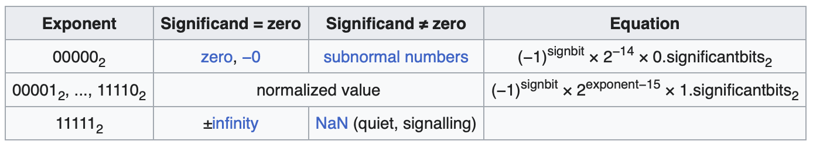

.. _sec-lib:

Library
========

.. contents::
   :local:
   :depth: 4

The theory of Floating Point Implementation
-------------------------------------------

Fixed-point representation is used to implement floating-point numbers,  
as illustrated in :numref:`fixed-point`. The calculation is described  
below.

.. _fixed-point:

  Fixed point representation

Assume Sign part: 1-bit (0:+, 1:-), Integer part: 2-bit, Fraction part: 2-bit.

- `3.0 * 0.5 = {0 11 00} * {0 00 10} = {(0 xor 0) (11 00 * 00 10) >> 2} =` 
  `{0 01 10} = 1.5`

The layout for half-precision floating-point format is shown in  
:numref:`floating-point-half`.

.. _floating-point-half:

  IEEE 754 half precision of Floating point representation [#ieee754-half]_

IEEE-754 floating standard also consider NaN (Not a Number) such as 0/0 and 
:math:`\infty` as :numref:`exp-enc`.

Floating-point arithmetic can be implemented in both software and hardware.

The 16-bit product `a * b` can be computed by first converting both `a` and `b` 
to fixed-point format using more bits of memory or registers. After performing the 
multiplication as fixed-point arithmetic, the result is converted back, as 
described on this website [#fp-calc]_.

An example of multiplication using exponent base 2 is given below:

- Precondition: `a` and `b` are normalized IEEE half-precision (16-bit) floating 
  point values [#ieee754-half]_.
  The exponent bias is 15. For example: 15 -> 0, 1 -> -14, 30 -> 15, and 31 -> NaN.

- Transformation for `a * b`:

  1. `{sign-bit(a) xor sign-bit(b)} {exponent(a) + exponent(b) - 15}` 
     `{significand(a) * significand(b) >> 10}`
  2. Normalize the result.

- Example:

  a = 0.01 (binary) = `{0 01110 1000000000}`  
  b = 1.1 (binary) = `{0 10000 1100000000}`

  1. `a * b` = `{0 xor 0} {01110 + 10000 - 01111 = 01111}` 
     `{1000000000 * 1100000000 >> 10 = 0110000000}`
  2. Normalize: `{0 01111 0110000000}` → `{0 01110 1100000000}` = 0.011

Division is handled similarly:

- Transformation for `a / b`:

  1. `{sign-bit(a) xor sign-bit(b)}` 
     `{exponent(a) - exponent(b) + 15}` 
     `{significand(a) / significand(b) >> 10}`
  2. Normalize the result.

- Example:

  a = 0.01 (binary) = `{0 01110 1000000000}`  
  b = 1 (binary) = `{0 10000 1000000000}`

  1. `a / b` = `{0 xor 0} {01110 - 10000 + 01111 = 01101}` 
     `{1000000000 / 1000000000 << 9 = 1000000000}`
  2. Normalize: `{0 01101 0000000001}` → `{0 01101 1000000000}` = 0.01

The IEEE-754 floating-point standard also includes special cases such as NaN
(Not a Number), which can result from operations like 0/0, and `\infty`, as 
illustrated in :numref:`exp-enc`.

.. _exp-enc:

  Encoding of exponent for IEEE 754 half precision [#ieee754-half]_

Since normalization in floating-point arithmetic is a critical operation, the 
Cpu0 hardware provides `clz` (count leading zeros) and `clo` (count leading ones) 
instructions to speed up the normalization process.

The `compiler-rt` library implements floating-point multiplication by handling 
special cases like NaN and :math:`\infty` in the same way as described in the 
implementation above. It also uses `clz` and `clo` instructions to accelerate 
normalization, as shown below:

.. rubric:: ~/llvm/debug/compiler-rt/lib/builtins/fp_lib.h
.. code-block:: c++

  #if defined SINGLE_PRECISION
  static __inline int rep_clz(rep_t a) { return __builtin_clz(a); }
  ...
  #endif
  ...
  static __inline rep_t toRep(fp_t x) {
    const union {
      fp_t f;
      rep_t i;
    } rep = {.f = x};
    return rep.i;
  }
  ...
  static __inline int normalize(rep_t *significand) {
    const int shift = rep_clz(*significand) - rep_clz(implicitBit);
    *significand <<= shift;
    return 1 - shift;
  }

.. rubric:: ~/llvm/debug/compiler-rt/lib/builtins/fp_mul_impl.inc
.. code-block:: c++

  #include "fp_lib.h"
  ...
  static __inline fp_t __mulXf3__(fp_t a, fp_t b) {
    const unsigned int aExponent = toRep(a) >> significandBits & maxExponent;
    const unsigned int bExponent = toRep(b) >> significandBits & maxExponent;
    ...
    int productExponent = aExponent + bExponent - exponentBias + scale;
    ...
      productHi |= (rep_t)productExponent << significandBits;
    ...
    return fromRep(productHi);
  }

The dependence for Cpu0 based on Compiler-rt's builtins
--------------------------------------------------------

Since Cpu0 does not have hardware floating-point instructions, it requires a 
software floating-point library to perform floating-point operations.

The LLVM `compiler-rt` project provides a software floating-point implementation 
(:numref:`swf-lib`), so I chose it for this purpose.

As `compiler-rt` assumes a Unix/Linux rootfs structure, we bridge the gap by 
adding a few empty header files in `exlbt/include`.

.. _swf-lib:
.. graphviz:: ../Fig/lib/lib.gv
  :caption: compiler-rt\/lib\/builtins' software float library

The dependencies for `compiler-rt` on `libm` are shown in 
:numref:`compiler-rrt-dep`.
  
.. _compiler-rrt-dep-short:
.. graphviz:: ../Fig/lib/compiler-rt-dep-short.gv
  :caption: Dependences for compiler-rt on libm
  

.. table:: `lldb` dependences

  ==============  ========================== 
  functions       depend on
  ==============  ==========================
  scanf           newlib/libc
  printf          sanitizer_printf.c of compiler-rt
  ==============  ==========================

.. table:: sanitizer_printf.c of `compiler-rt` dependences

  ====================  ========================== 
  functions             depend on
  ====================  ==========================
  sanitizter_printf.c   builtins of compiler-rt
  ====================  ==========================

C Library (Newlib)
------------------

Since the complex type in `compiler-rt` depends on `libm`, I port Newlib in
this section.

Newlib is a C library designed for bare-metal platforms. It consists of two
libraries: `libc` and `libm`. The `libc` library supports I/O, file, and
string functions, while `libm` provides mathematical functions.

The official website for Newlib is available here [#newlib]_, and the `libm`
library can be found here [#newlib-libm]_.

Since the next section, `compiler-rt/builtins`, depends on `libm`, please run
the following bash script to install and build Newlib for Cpu0.

.. rubric:: lbt/exlbt/newlib-cpu0.sh
.. literalinclude:: ../exlbt/newlib-cpu0.sh

.. note:: **In order to add Cpu0 backend to NewLib, the following changes in lbt/exlbt/newlib.patch** 

  - lbt/exlbt/newlib-cygwin/newlib/libc/machine/cpu0/setjmp.S is added; 

  - newlib-cygwin/config.sub, newlib-cygwin/newlib/configure.host, 
    newlib-cygwin/newlib/libc/include/machine/ieeefp.h, 
    newlib-cygwin/newlib/libc/include/sys/unistd.h and
    newlib-cygwin/newlib/libc/machine/configure are modified for adding cpu0.

.. rubric:: lbt/exlbt/newlib.patch
.. literalinclude:: ../exlbt/newlib.patch

.. rubric:: lbt/exlbt/newlib-cygwin/newlib/libc/machine/cpu0/setjmp.S
.. literalinclude:: ../exlbt/newlib-cygwin/newlib/libc/machine/cpu0/setjmp.S

.. code-block:: console

  cschen@cschendeiMac exlbt % bash newlib-cpu0.sh

The `libm.a` library depends on the `errno` variable from `libc`, which is
defined in `sys/errno.h`.

- libgloss is BSP license [#libgloss-bsp]_

Compiler-rt's builtins
----------------------

Compiler-rt is a project for runtime libraries implementation [#compiler-rt]_.
The `compiler-rt/lib/builtins` directory provides functions for basic operations
such as `+`, `-`, `*`, `/`, etc., on `float` or `double` types. It also supports
type conversions between floating-point and integer, or conversions involving
types wider than 32 bits, such as `long long`.

The `compiler-rt/lib/builtins/README.txt` [#builtins-README]_ lists the
dependent functions used throughout the builtins. These dependent functions are
a small subset of `libm`, which are defined in
`compiler-rt/lib/builtins/int_math.h` [#builtins-int_math]_.

.. rubric:: ~git/newlib-cygwin/build-cpu032I-eb/Makefile
.. code-block:: Makefile

  MATHDIR = math

  # The newlib hardware floating-point routines have been disabled due to
  # inaccuracy.  If you wish to work on them, you will need to edit the
  # configure.in file to re-enable the configuration option.  By default,
  # the NEWLIB_HW_FP variable will always be false.
  #MATHDIR = mathfp 

As shown in the Makefile above, Newlib uses the `libm/math` directory.

The dependencies for the builtin functions of compiler-rt on `libm` are shown in
:numref:`compiler-rrt-dep`.

.. _compiler-rrt-dep:
.. graphviz:: ../Fig/lib/compiler-rt-dep.gv
  :caption: Dependences for builtin functions of compiler-rt on libm
  
In this section, I copied test cases for verification of software floating point
(SW FP) from `compiler-rt/test/builtins/Unit` to
`compiler-rt-test/builtins/Unit/`.

Since `lbt/exlbt/input/printf-stdarg.c` does not support `%lld` (long long
integer, 64-bit), and the test cases in
`compiler-rt/test/builtins/Unit` require this format to verify SW FP results, I
ported `sanitizer_printf.cpp` and `sanitizer_internal_defs.h` to
`lbt/exlbt/input/` from `compiler-rt/lib/sanitizer_common/`.

.. table:: compiler-rt builtins dependences on newlib/libm (open source libc 
           for bare metal) 

  ==============  =============================  ==============
  function        file                           directory of libm 
  ==============  =============================  ==============
  abort           lbt/exlbt/compiler-rt/
                  cpu0/abort.c
  isinf           s_isinf.c                      newlib-cygwin/newlib/libm/common
  isnan           s_isnan.c                        "
  fabsl           fabsl.c                          "
  fmax            s_fmax.c                         "
  fmaxf           sf_fmax.c                        "
  fmaxl           fmaxl.c                          "
  log             log.c                            "
  logf            sf_log.c                         "
  logl            logl.c                           "
  scalbn          s_scalbn.c                       "
  scalbnf         sf_scalbn.c                      "
  scalbnl         scalblnl.c                       "
  copysign        s_copysign.c                     "
  copysignf       sf_copysign.c                    "
  copysignl       copysignl.c                      "
  fabsl           fabsl.c                          "
  --------------  -----------------------------  --------------
  fabs            s_fabs.c                       newlib-cygwin/newlib/libm/math
  fabsf           sf_fabs.c                        "
  ==============  =============================  ==============

- Libm has no dependencies on any other library.

- Only the `complex` type in `compiler-rt/lib/builtins` depends on libm. Other
  types (float and double) only depend on `__builtin_clz()`, `__builtin_clo()`,
  and `abort()`. I have ported `abort()` in
  `lbt/exlbt/compiler-rt/cpu0/abort.c`.

- All test cases in `compiler-rt/test/builtins/Unit` depend on `printf(%lld or
  %llX, ...)`. I ported this functionality from
  `compiler-rt/lib/sanitizer_common/sanitizer_printf.cpp` to
  `lbt/exlbt/input/sanitizer_printf.cpp`.

- The dependent functions for `complex` type have been ported from `newlib/libm`.

- Except for `builtins`, the other three components—sanitizer runtimes,
  profile and BlocksRuntime in `compiler-rt` are not needed for my embedded
  Cpu0.

The libgcc integer and soft float libraries [#lib-gcc]_ [#int-lib]_ 
[#sw-float-lib]_ are functionally equivalent to the builtins in `compiler-rt`.

In `compiler-rt/lib/builtins`, the file-level dependencies are listed in the
following table.

.. table:: dependence between files for `compiler-rt/lib/builtins`

  ====================  ========================== 
  functions             depend on
  ====================  ==========================
  \*.c                  \*.inc
  \*.inc                \*.h
  ====================  ==========================

Though the 'rt' stands for Runtime Libraries, most functions in the `builtins`
library are written in target-independent C code. These functions can be
compiled and statically linked into the target.

When you compile the following C code, `llc` will generate a **call to
__addsf3** to invoke the compiler-rt floating-point function for Cpu0.

This is because Cpu0 does not have hardware floating-point instructions, so the
Cpu0 backend does not handle the DAG for `__addsf3`. As a result, LLVM treats
the DAG for `__addsf3` as a function call, rather than a direct float-add
instruction.

.. rubric:: lbt/exlbt/input/ch_call_compilerrt_func.c
.. literalinclude:: ../exlbt/input/ch_call_compilerrt_func.c

.. code-block:: console

  chungshu@ChungShudeMacBook-Air input % clang -target mips-unknown-linux-gnu -S 
  ch_call_compilerrt_func.c -emit-llvm
  chungshu@ChungShudeMacBook-Air input % cat ch_call_compilerrt_func.ll
    ...
    %4 = load float, float* %1, align 4
    %5 = load float, float* %2, align 4
    %6 = fadd float %4, %5

  chungshu@ChungShudeMacBook-Air input % ~/llvm/test/build/bin/llc -march=cpu0 
  -mcpu=cpu032II -relocation-model=static -filetype=asm ch_call_compilerrt_func.ll -o -
	...
	ld	$4, 20($fp)
	ld	$5, 16($fp)
	jsub	__addsf3

For some bare-metal or embedded applications, the C code does not need the
file and high-level I/O features provided by `libc`.

`libm` provides a wide range of functions to support software floating-point
operations beyond basic arithmetic [#math]_.

`libc` provides file handling, high-level I/O functions, and some basic float
operations [#clib]_.

Cpu0 uses `compiler-rt/lib/builtins` and
`compiler-rt/lib/sanitizer_common/sanitizer_printf.cpp` to support
software floating-point.

The `compiler-rt/lib/builtins` is a target-independent C implementation of a
software floating-point library. Cpu0 currently implements only
`compiler-rt-12.x/cpu0/abort.c` to support this functionality.

.. note:: **Why are these libm functions called builtins in
   compiler-rt/lib/builtins?**

   Though these `compiler-rt` built-in functions are written in C, CPUs can
   provide hardware float or high-level instructions to accelerate them.
   Compilers like Clang can convert float-type operations in C into LLVM IR.
   Then, the backend compiles them into specific hardware instructions for
   performance.

To optimize `libm` functions, many CPUs include hardware floating-point
instructions.

For example, the Clang compilation and backend translation go as follows:

- `float a, b, c; a = b * c;` → (Clang) → `%add = fmul float %0, %1`
  [#llvm-fmul]_

MIPS backend compiles `fmul` into hardware instructions:

- `%add = fmul float %0, %1` → (LLVM-MIPS) → `mul.s`
  [#llvm-fmul]_ [#mips-fmadd1.ll]_

Cpu0 backend, without hardware float support, compiles `fmul` into a library
function call:

- `%add = fmul float %0, %1` → (LLVM-Cpu0) → `jsub fmul`
  [#llvm-fmul]_

For high-level math functions, Clang compiles float-type operations in C
into LLVM intrinsic functions. Then, LLVM backends for different CPUs compile
these intrinsics into hardware instructions when available.

For example, Clang compiles `pow()` into `@llvm.pow.f32` as follows:

- `%pow = call float @llvm.pow.f32(float %x, float %y)` [#clang-pow]_

The AMDGPU backend compiles `@llvm.pow.f32` into a sequence of instructions:

- `%pow = call float @llvm.pow.f32(float %x, float %y)`  
  → (LLVM-AMDGPU) → `... + v_exp_f32_e32 v0, v0 + ...` [#clang-pow]_

The MIPS backend compiles `@llvm.pow.f32` into a function call:

- `%pow = call float @llvm.pow.f32(float %x, float %y)`  
  → (LLVM-MIPS) → `jal powf` [#clang-pow]_

Clang treats these `libm` functions as built-ins and compiles them into LLVM IR
or intrinsics. Then, the LLVM backend can either lower them into hardware
instructions (if available) or generate function calls to built-in implementations
in `libm`.

The following quote is from Clang's documentation [#clang-builtin-comment]_:

.. code-block:: c++

  RValue CodeGenFunction::EmitBuiltinExpr(...)
    ...
    // There are LLVM math intrinsics/instructions corresponding to math library 
    // functions except the LLVM op will never set errno while the math library
    // might. Also, math builtins have the same semantics as their math library
    // twins. Thus, we can transform math library and builtin calls to their
    // LLVM counterparts if the call is marked 'const' (known to never set errno).

Verification
~~~~~~~~~~~~

The following `sanitizer_printf.cpp`, extended from compiler-rt, supports
`printf("%lld")`. Its implementation calls some floating-point library
functions in `compiler-rt/lib/builtins`.

.. rubric:: exlbt/include/math.h
.. literalinclude:: ../exlbt/include/math.h

.. rubric:: exlbt/include/stdio.h
.. literalinclude:: ../exlbt/include/stdio.h

.. rubric:: exlbt/include/stdlib.h
.. literalinclude:: ../exlbt/include/stdlib.h

.. rubric:: exlbt/include/string.h
.. literalinclude:: ../exlbt/include/string.h

.. rubric:: exlbt/compiler-rt/cpu0/abort.c
.. literalinclude:: ../exlbt/compiler-rt/cpu0/abort.c

.. rubric:: exlbt/input/sanitizer_internal_defs.h
.. literalinclude:: ../exlbt/input/sanitizer_internal_defs.h

.. rubric:: exlbt/input/sanitizer_printf.cpp
.. literalinclude:: ../exlbt/input/sanitizer_printf.cpp

The above two `sanitizer_*.*` files are ported from compiler-rt. I added code
to support left-justify for number printf and right-justify for string
printf. The following `ch_float.cpp` tests the float library.

.. rubric:: lbt/exlbt/compiler-rt-12.x/builtins/Makefile
.. literalinclude:: ../exlbt/compiler-rt-12.x/builtins/Makefile

.. rubric:: exlbt/input/ch_float.cpp
.. literalinclude:: ../exlbt/input/ch_float.cpp
    :start-after: /// start

.. rubric:: exlbt/input/Makefile.float
.. literalinclude:: ../exlbt/input/Makefile.float

.. code-block:: console

  chungshu@ChungShudeMacBook-Air input % bash make.sh cpu032II eb Makefile.float
  ...
  endian =  BigEndian
  ISR address:00020614
  0   /* 0: big endian, 1: little endian */

  chungshu@ChungShudeMacBook-Air verilog % iverilog -o cpu0IIs cpu0IIs.v 
  chungshu@ChungShudeMacBook-Air verilog % ./cpu0IIs
  ...

  a: 100000007FFFFFFF, 100000007fffffff, 1152921506754330623
  b: 10000000, 268435456
  b: 10000000, 268435456
  Hello world!
  printf test
  <null> is null pointer
  5 = 5
  -2147483647 = - max int
  char a = 'a'
  hex ff = ff
  hex 00 = 00
  signed -3 = unsigned 4294967293 = hex fffffffd
  0 message(s)
  0 message(s) with %
  justif: "left      "
  justif: "     right"
   3: 0003 zero padded
   3: 3    left justif.
   3:    3 right justif.
  -3: -003 zero padded
  -3: -3   left justif.
  -3:   -3 right justif.
  test_longlong_shift1() = 289
  test_longlong_shift2() = 22
  test_shift_left<long long>(0x12, 4LL) = 288
  test_shift_right<long long>(0x001666660000000a, 48LL) = 22
  test_shift_right<unsigned long long>(0x001666660000000a, 48LLu) = 22
  (int)test_add<float, float, float>(-2.2, 3.3) = 1
  (int)test_mul<float, float, float>(-2.2, 3.3) = -7
  (int)test_div<float, float, float>(-1.8, 0.5) = -3
  (int)test_add<double, double, float>(-2.2, 3.3) = 1
  (int)test_add<double, float, double>(-2.2, 3.3) = 1
  (int)test_add<float, float, double>(-2.2, 3.3) = 1
  (int)test_mul<double, float, double>(-2.2, 3.3) = -7
  (int)test_mul<float, float, double>(-2.2, 3.3) = -7
  (int)test_div<double, double, double>(-1.8, 0.5) = -3
  test_div<long long, long long, long long>(-10LL, 4LL) = -2
  ...             
  RET to PC < 0, finished!

The `exlbt/input/compiler-rt-test/builtins/Unit` directory is copied from
`compiler-rt/test/builtins/Unit` as follows,

.. rubric:: exlbt/input/ch_builtins.cpp
.. literalinclude:: ../exlbt/input/ch_builtins.cpp

.. rubric:: exlbt/input/Makefile.builtins
.. literalinclude:: ../exlbt/input/Makefile.builtins

Run the tests as follows,

.. code-block:: console

  chungshu@ChungShudeMacBook-Air input % bash make.sh cpu032II eb Makefile.builtins
  ...
  chungshu@ChungShudeMacBook-Air verilog % ./cpu0IIs
  ...
  absvdi2_test(): PASS!
  absvsi2_test(): PASS!
  absvti2_test(): SKIPPED!
  adddf3vfp_test(): SKIPPED!
  addsf3vfp_test(): SKIPPED!
  addvdi3_test(): PASS!
  addvsi3_test(): PASS!
  addvti3_test(): SKIPPED!
  ashldi3_test(): PASS!
  ashlti3_test(): SKIPPED!
  ashrdi3_test(): PASS!
  ashrti3_test(): SKIPPED!
  bswapdi2_test(): PASS!
  bswapsi2_test(): PASS!
  clzdi2_test(): PASS!
  clzsi2_test(): PASS!
  clzti2_test(): SKIPPED!
  cmpdi2_test(): PASS!
  cmpti2_test(): SKIPPED!
  comparedf2_test(): PASS!
  comparesf2_test(): PASS!
  cpu_model_test(): SKIPPED!
  ctzdi2_test(): PASS!
  ctzsi2_test(): PASS!
  ctzti2_test(): SKIPPED!
  divdc3_test(): PASS!
  divdf3_test(): PASS!
  divdf3vfp_test(): SKIPPED!
  divdi3_test(): PASS!
  divmodsi4_test(): PASS!
  divmodti4_test(): SKIPPED!
  divsf3_test(): PASS!
  divsf3vfp_test(): SKIPPED!
  divsi3_test(): PASS!
  divtc3_test(): PASS!
  divtf3_test(): SKIPPED!
  divti3_test(): SKIPPED!
  divxc3_test(): PASS!
  eqdf2vfp_test(): SKIPPED!
  eqsf2vfp_test(): SKIPPED!
  eqtf2_test(): SKIPPED!
  extenddftf2_test(): SKIPPED!
  extendhfsf2_test(): PASS!
  extendhftf2_test(): SKIPPED!
  extendsfdf2vfp_test(): SKIPPED!
  extendsftf2_test(): SKIPPED!
  gedf2vfp_test(): SKIPPED!
  gesf2vfp_test(): SKIPPED!
  getf2_test(): SKIPPED!
  gtdf2vfp_test(): SKIPPED!
  gtsf2vfp_test(): SKIPPED!
  gttf2_test(): SKIPPED!
  ledf2vfp_test(): SKIPPED!
  lesf2vfp_test(): SKIPPED!
  letf2_test(): SKIPPED!
  lshrdi3_test(): PASS!
  lshrti3_test(): SKIPPED!
  ltdf2vfp_test(): SKIPPED!
  ltsf2vfp_test(): SKIPPED!
  lttf2_test(): SKIPPED!
  moddi3_test(): PASS!
  modsi3_test(): PASS!
  modti3_test(): SKIPPED!
  muldc3_test(): PASS!
  muldf3vfp_test(): SKIPPED!
  muldi3_test(): PASS!
  mulodi4_test(): PASS!
  mulosi4_test(): PASS!
  muloti4_test(): SKIPPED!
  mulsc3_test(): PASS!
  mulsf3vfp_test(): SKIPPED!
  multc3_test(): SKIPPED!
  multf3_test(): SKIPPED!
  multi3_test(): SKIPPED!
  mulvdi3_test(): PASS!
  mulvsi3_test(): PASS!
  mulvti3_test(): SKIPPED!
  mulxc3_test(): PASS!
  nedf2vfp_test(): SKIPPED!
  negdf2vfp_test(): SKIPPED!
  negdi2_test(): PASS!
  negsf2vfp_test(): SKIPPED!
  negti2_test(): SKIPPED!
  negvdi2_test(): PASS!
  negvsi2_test(): PASS!
  negvti2_test(): SKIPPED!
  nesf2vfp_test(): SKIPPED!
  netf2_test(): SKIPPED!
  subdf3vfp_test(): SKIPPED!
  subsf3vfp_test(): SKIPPED!
  subtf3_test(): SKIPPED!
  subvdi3_test(): PASS!
  subvsi3_test(): PASS!
  subvti3_test(): SKIPPED!
  trampoline_setup_test(): SKIPPED!
  truncdfhf2_test(): PASS!
  truncdfsf2_test(): PASS!
  truncdfsf2vfp_test(): SKIPPED!
  truncsfhf2_test(): PASS!
  trunctfdf2_test(): SKIPPED!
  trunctfhf2_test(): SKIPPED!
  trunctfsf2_test(): SKIPPED!
  ucmpdi2_test(): PASS!
  ucmpti2_test(): SKIPPED!
  udivdi3_test(): PASS!
  udivmoddi4_test(): PASS!
  udivmodsi4_test(): PASS!
  udivmodti4_test(): SKIPPED!
  udivsi3_test(): PASS!
  udivti3_test(): SKIPPED!
  umoddi3_test(): PASS!
  umodsi3_test(): PASS!
  umodti3_test(): SKIPPED!
  unorddf2vfp_test(): SKIPPED!
  unordsf2vfp_test(): SKIPPED!
  unordtf2_test(): SKIPPED!
  ...          
  RET to PC < 0, finished!

.. [#fp-calc] https://witscad.com/course/computer-architecture/chapter/floating-point-arithmetic

.. [#ieee754-half] https://en.wikipedia.org/wiki/Half-precision_floating-point_format

.. [#newlib] https://sourceware.org/newlib/

.. [#newlib-libm] https://sourceware.org/newlib/libm.html

.. [#libgloss-bsp] https://www.embecosm.com/appnotes/ean9/html/ch03s01.html

.. [#compiler-rt] http://compiler-rt.llvm.org/

.. [#builtins-README] https://github.com/llvm-mirror/compiler-rt/blob/master/lib/builtins/README.txt

.. [#builtins-int_math] https://github.com/microsoft/compiler-rt/blob/master/lib/builtins/int_math.h

.. [#lib-gcc] https://gcc.gnu.org/onlinedocs/gccint/Libgcc.html

.. [#int-lib] https://gcc.gnu.org/onlinedocs/gccint/Integer-library-routines.html#Integer-library-routines

.. [#sw-float-lib] https://gcc.gnu.org/onlinedocs/gccint/Soft-float-library-routines.html#Soft-float-library-routines

.. [#math] https://www.programiz.com/c-programming/library-function/math.h

.. [#clib] https://www.cplusplus.com/reference/clibrary

.. [#mips-fmadd1.ll] https://github.com/llvm/llvm-project/blob/main/llvm/test/CodeGen/Mips/fmadd1.ll

.. [#llvm-fmul] Reference https://github.com/Jonathan2251/lbd/tree/master/lbdex/input/ch7_1_fmul.c

.. [#clang-pow] Reference https://github.com/Jonathan2251/lbt/tree/master/exlbt/input/test_pow.c

.. [#clang-builtin-comment] https://github.com/llvm/llvm-project/blob/main/clang/lib/CodeGen/CGBuiltin.cpp
