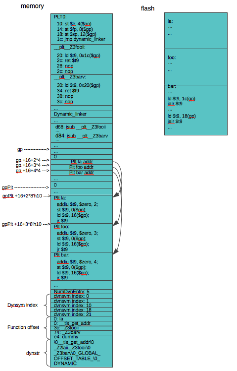
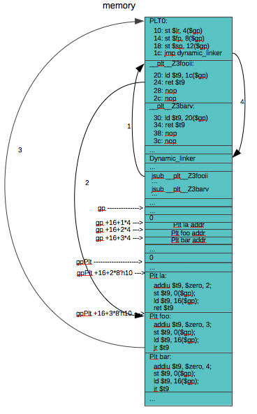
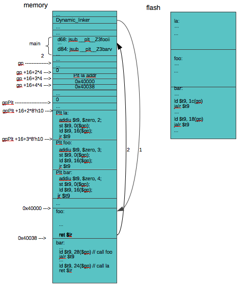
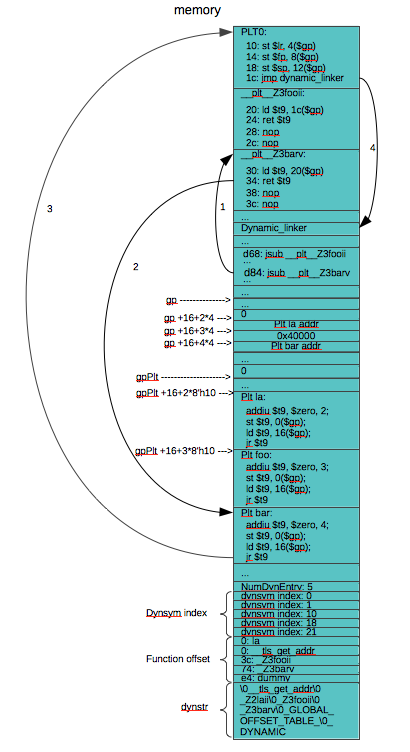
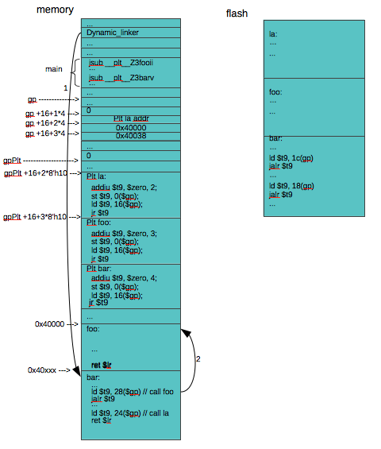
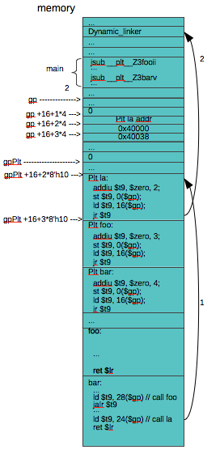

.. _sec-lld:

Cpu0 ELF linker
===============

.. contents::
   :local:
   :depth: 4

Like llvm, lld linker include a couple of target in ELF format handling.
The term Cpu0 backend used in this chapter can refer to the ELF format handling 
for Cpu0 target machine under lld, llvm compiler backend, or both. 
Suppose readers will easy knowing what it refer to.

.. _lld-f-workflow: 
.. figure:: ../Fig/about/1.png
  :scale: 100 %
  :align: center

  Code generation and execution flow

As depicted in :num:`Figure #lld-f-workflow` of chapter About. Beside llvm backend,
we implement ELF linker and elf2hex to run on Cpu0 verilog simulator.
This chapter extends lld to support Cpu0 backend as well as elf2hex to replace
Cpu0 loader.
After link with lld,
the program with global variables can be allocated in ELF file format layout. 
Meaning the relocation records of global variables is resolved. In addition, 
llvm-objdump driver is modified for supporting generate Hex file from ELF by
command ``llvm-objdump -elf2hex``.
With these two tools supported, the global variables exists in 
section .data and .rodata can be accessed and transfered to Hex file which feeds  
to Verilog Cpu0 machine and run on your PC/Laptop.

As the previouse chapters mentioned, Cpu0 has two relocation models for static 
link and dynamic link, respectively, which controlled by option 
``-relocation-model`` in ``llc``. 
This chapter supports the static link fully, and part of dynamic link for 
demostration purpose. Since dynamic link needs the OS involement and the 
Cpu0 is run on Verilog bare metal simulator, the dynamic linker program 
is added and the Cpu0 Verilog code is extended to demostrate these Cpu0 PIC mode 
instructions are work correctly in dynamice link. 
However, these part of Cpu0 Verilog codes are not needed in a real machine with 
OS support, and the Cpu0 lld's and elf2hex's dynamic linker function is not full 
implemented. 
They are programmed by a specific shared library name since the shared library 
locating needs the OS's help (files management is part of OS's job). 
Without OS, these things cannot be solved and dynamic link is impossible to 
finish.
Anyway, for the dynamic link demostration, we can implement dynamic linker 
program and adapt lld, elf2hex, and Cpu0 Verilog code to support a specific 
shared library and verify the dynamic link result.
In reality, the Micro CPUs without OS or tiny OS inside only support static 
link for C language.

About lld please refer LLD web site here [#]_ and LLD install requirement on 
Linux here [#]_. 
Currently, lld can be built by: gcc and clang 3.5 compiler on Ubuntu, and gcc 
on Fedora, as I have tried. 
On iMac, lld can be built by clang with the Xcode version as the next sub 
section.
If you run with Virtual Machine (VM), please keep your phisical memory size 
setting over 1GB to avoid insufficient memory link error.

ELF to Hex
-----------

Add elf2hex.h, elf2hex-dlink.h and update llvm-objdump driver to support ELF to 
Hex for Cpu0 backend as follows,

.. rubric:: exlbt/llvm-objdump/elf2hex-dlinker.h
.. literalinclude:: ../exlbt/llvm-objdump/elf2hex-dlinker.h

.. rubric:: exlbt/llvm-objdump/elf2hex.h
.. literalinclude:: ../exlbt/llvm-objdump/elf2hex.h

.. rubric:: exlbt/llvm-objdump/llvm-objdump.cpp
.. literalinclude:: ../exlbt/llvm-objdump/llvm-objdump.cpp
    :start-after: // 1 llvm-objdump -elf2hex code update begin:
    :end-before: // 1 llvm-objdump -elf2hex code udpate end:
.. literalinclude:: ../exlbt/llvm-objdump/llvm-objdump.cpp
    :start-after: // 2 llvm-objdump -elf2hex code update begin:
    :end-before: // 2 llvm-objdump -elf2hex code udpate end:

The code included in "#ifdef DLINK" are for dynamic linker support.
The elf2hex.h supports both endian dump.


Create Cpu0 backend under LLD
-----------------------------

Setup Cpu0 backend under lld
~~~~~~~~~~~~~~~~~~~~~~~~~~~~

LLD project is underdevelopment and can be compiled only with c++11 standard 
(C++2011 year announced standard). 
For iMac, our software is OS X version 10.9.1 and Xcode version 5.0.2. 
For old iMac software version, you can install VM (such as Virtual Box) and 
build lld as Linux platform. Please download lld from llvm web [#]_ and put lld 
souce code on {llvm-src}/tools/lld just like we download llvm and clang as 
shown in Appendex A of book "Tutorial: Creating an LLVM Backend for the Cpu0 
Architecture" as follows.

.. code-block:: bash

  1-160-136-173:tools Jonathan$ pwd
  /Users/Jonathan/llvm/test/src/tools
  1-160-136-173:tools Jonathan$ ls
  ...
  lld              llvm-config      llvm-extract    llvm-nm           llvm-stress   obj2yaml

Next, setup Cpu0 backend as follows,

.. code-block:: bash

  1-160-136-173:Cpu0 Jonathan$ cd ../../../tools/lld/lib/ReaderWriter/ELF/
  1-160-136-173:ELF Jonathan$ pwd
  /Users/Jonathan/llvm/test/src/tools/lld/lib/ReaderWriter/ELF
  1-160-136-173:ELF Jonathan$ cp -rf ~/test/lbt/exlbt/lld/* .
  1-160-136-173:ELF Jonathan$ mv Reference.h ../../../include/lld/Core/.


Finally, update llvm-objdump to support converting ELF file to Hex file as 
follows,

.. code-block:: bash

  1-160-136-173:ELF Jonathan$ cd ../../../../llvm-objdump/
  1-160-136-173:llvm-objdump Jonathan$ pwd
  /Users/Jonathan/llvm/test/src/tools/llvm-objdump
  1-160-136-173:llvm-objdump Jonathan$ cp -rf ~/test/lbt/exlbt/llvm-objdump/* .

Now, build lld with Cpu0 backend as follows,

.. code-block:: bash

  1-160-136-173:cmake_debug_build Jonathan$ cmake -DCMAKE_CXX_COMPILER=clang++ -
  DCMAKE_C_COMPILER=clang -DCMAKE_CXX_FLAGS=-std=c++11 -DCMAKE_BUILD_TYPE=Debug
  -G "Xcode" ../src
  ...
  -- Targeting Cpu0
  ...
  -- Configuring done
  -- Generating done
  -- Build files have been written to: /Users/Jonathan/llvm/test/cmake_debug_build

If using VM (guest machine is Linux) or Linux, build as follows,

.. code-block:: bash

  [Gamma@localhost cmake_debug_build]$ cmake -DCMAKE_CXX_COMPILER=g++ -
  DCMAKE_C_COMPILER=gcc -DCMAKE_CXX_FLAGS=-std=c++11 -DCMAKE_BUILD_TYPE=Debug
  -G "Unix Makefiles" ../src
  ...
  -- Targeting Cpu0
  ...
  -- Configuring done
  -- Generating done
  -- Build files have been written to: /home/cschen/llvm/test/cmake_debug_build


Cpu0 backend souce code
~~~~~~~~~~~~~~~~~~~~~~~

The code added on lld to support Cpu0 ELF as follows,


.. rubric:: exlbt/lld/CMakeLists.txt
.. code-block:: c++

  target_link_libraries(lldELF
    ...
    lldCpu0ELFTarget
    lldCpu0elELFTarget
    )

.. rubric:: exlbt/lld/Atoms.h
.. code-block:: c++

  class SimpleELFDefinedAtom : public SimpleDefinedAtom {
    ...
    void addReferenceELF_Cpu0(uint16_t relocType, uint64_t off, const Atom *t,
                              Reference::Addend a) {
      this->addReferenceELF(Reference::KindArch::Cpu0, relocType, off, t, a);
    }
  }

.. rubric:: exlbt/lld/ELFFile.h
.. code-block:: c++

  template <class ELFT> Reference::KindArch ELFFile<ELFT>::kindArch() {
    switch (_objFile->getHeader()->e_machine) {
    ...
    case llvm::ELF::EM_CPU0:
      return Reference::KindArch::Cpu0;
    case llvm::ELF::EM_CPU0_LE:
      return Reference::KindArch::Cpu0el;
    ...
  }

.. rubric:: exlbt/lld/ELFLinkingContext.cpp
.. code-block:: c++

  uint16_t ELFLinkingContext::getOutputMachine() const {
    switch (getTriple().getArch()) {
    ...
    case llvm::Triple::cpu0:
      return llvm::ELF::EM_CPU0;
    case llvm::Triple::cpu0el:
      return llvm::ELF::EM_CPU0_LE;
    ...
    }
  }
  ...
  std::unique_ptr<ELFLinkingContext>
  ELFLinkingContext::create(llvm::Triple triple) {
    switch (triple.getArch()) {
    ...
    case llvm::Triple::cpu0:
      return std::unique_ptr<ELFLinkingContext>(
          new lld::elf::Cpu0LinkingContext(triple));
    case llvm::Triple::cpu0el:
      return std::unique_ptr<ELFLinkingContext>(
          new lld::elf::Cpu0elLinkingContext(triple));
  }

.. rubric:: exlbt/lld/Targets.h
.. code-block:: c++

  #include "Cpu0/Cpu0Target.h"
  #include "Cpu0el/Cpu0Target.h"

.. rubric:: exlbt/lld/Reference.h
.. code-block:: c++

    enum class KindArch {
      ...
      Cpu0    = 98,
      Cpu0el  = 99
    };

.. rubric:: exlbt/lld/Cpu0/CMakeLists.txt
.. literalinclude:: ../exlbt/lld/Cpu0/CMakeLists.txt

.. rubric:: exlbt/lld/Cpu0/Cpu0DynamicLibraryWriter.h
.. literalinclude:: ../exlbt/lld/Cpu0/Cpu0DynamicLibraryWriter.h

.. rubric:: exlbt/lld/Cpu0/Cpu0ExecutableWriter.h
.. literalinclude:: ../exlbt/lld/Cpu0/Cpu0ExecutableWriter.h

.. rubric:: exlbt/lld/Cpu0/Cpu0LinkingContext.h
.. literalinclude:: ../exlbt/lld/Cpu0/Cpu0LinkingContext.h

.. rubric:: exlbt/lld/Cpu0/Cpu0LinkingContext.cpp
.. literalinclude:: ../exlbt/lld/Cpu0/Cpu0LinkingContext.cpp

.. rubric:: exlbt/lld/Cpu0/Cpu0RelocationHandler.h
.. literalinclude:: ../exlbt/lld/Cpu0/Cpu0RelocationHandler.h

.. rubric:: exlbt/lld/Cpu0/Cpu0RelocationHandler.cpp
.. literalinclude:: ../exlbt/lld/Cpu0/Cpu0RelocationHandler.cpp

.. rubric:: exlbt/lld/Cpu0/Cpu0RelocationPass.h
.. literalinclude:: ../exlbt/lld/Cpu0/Cpu0RelocationPass.h

.. rubric:: exlbt/lld/Cpu0/Cpu0RelocationPass.cpp
.. literalinclude:: ../exlbt/lld/Cpu0/Cpu0RelocationPass.cpp

.. rubric:: exlbt/lld/Cpu0/Cpu0LinkingContext.cpp
.. literalinclude:: ../exlbt/lld/Cpu0/Cpu0LinkingContext.cpp

.. rubric:: exlbt/lld/Cpu0/Cpu0Target.h
.. literalinclude:: ../exlbt/lld/Cpu0/Cpu0Target.h

.. rubric:: exlbt/lld/Cpu0/Cpu0TargetHandler.h
.. literalinclude:: ../exlbt/lld/Cpu0/Cpu0TargetHandler.h

.. rubric:: exlbt/lld/Cpu0/Cpu0TargetHandler.cpp
.. literalinclude:: ../exlbt/lld/Cpu0/Cpu0TargetHandler.cpp

.. rubric:: exlbt/lld/Cpu0el/CMakeLists.txt
.. literalinclude:: ../exlbt/lld/Cpu0el/CMakeLists.txt

.. rubric:: exlbt/lld/Cpu0el/Cpu0DynamicLibraryWriter.h
.. literalinclude:: ../exlbt/lld/Cpu0el/Cpu0DynamicLibraryWriter.h

.. rubric:: exlbt/lld/Cpu0el/Cpu0ExecutableWriter.h
.. literalinclude:: ../exlbt/lld/Cpu0el/Cpu0ExecutableWriter.h

.. rubric:: exlbt/lld/Cpu0el/Cpu0LinkingContext.h
.. literalinclude:: ../exlbt/lld/Cpu0el/Cpu0LinkingContext.h

.. rubric:: exlbt/lld/Cpu0el/Cpu0LinkingContext.cpp
.. literalinclude:: ../exlbt/lld/Cpu0el/Cpu0LinkingContext.cpp

.. rubric:: exlbt/lld/Cpu0el/Cpu0RelocationHandler.h
.. literalinclude:: ../exlbt/lld/Cpu0el/Cpu0RelocationHandler.h

.. rubric:: exlbt/lld/Cpu0el/Cpu0RelocationHandler.cpp
.. literalinclude:: ../exlbt/lld/Cpu0el/Cpu0RelocationHandler.cpp

.. rubric:: exlbt/lld/Cpu0el/Cpu0RelocationPass.h
.. literalinclude:: ../exlbt/lld/Cpu0el/Cpu0RelocationPass.h

.. rubric:: exlbt/lld/Cpu0el/Cpu0RelocationPass.cpp
.. literalinclude:: ../exlbt/lld/Cpu0el/Cpu0RelocationPass.cpp

.. rubric:: exlbt/lld/Cpu0el/Cpu0LinkingContext.cpp
.. literalinclude:: ../exlbt/lld/Cpu0el/Cpu0LinkingContext.cpp

.. rubric:: exlbt/lld/Cpu0el/Cpu0Target.h
.. literalinclude:: ../exlbt/lld/Cpu0el/Cpu0Target.h

.. rubric:: exlbt/lld/Cpu0el/Cpu0TargetHandler.h
.. literalinclude:: ../exlbt/lld/Cpu0el/Cpu0TargetHandler.h

.. rubric:: exlbt/lld/Cpu0el/Cpu0TargetHandler.cpp
.. literalinclude:: ../exlbt/lld/Cpu0/Cpu0TargetHandler.cpp


Above code in Cpu0 lld support both endian for static link and dynamic link. 
The "#ifdef DLINKER" is for dynamic link support. 
The directory Cpu0 is for big endian and Cpu0el is for little endian. 
They are almost same. I believe the lld structure will change to support both 
endian but at this point, the best way to do both endian support is duplicate 
the directory.


LLD introduction 
~~~~~~~~~~~~~~~~

In general, linker do the Relocation Records Resolve as Chapter ELF support 
depicted, and optimization for those cannot finish in compiler stage. One of 
the optimization opportunities in linker is Dead Code Stripping which is 
explained in this section. 

List the LLD project status as follows,

- The lld project aims to to be the built-in linker for clang/llvm.
  Currently, clang must invoke the system linker to produce executables.

- web site http://lld.llvm.org/

- Current Status

  - lld is in its early stages of development.
  - It can currently self host on Linux x86-64 with -static.

- How to build

  - cmake -DCMAKE_CXX_COMPILER=g++ -DCMAKE_C_COMPILER=gcc -DCMAKE_CXX_FLAGS=-std
    =c++11 -DCMAKE_BUILD_TYPE=Debug -G "Unix Makefiles" ../src/


This whole book focuses on backend design, and this chapter is same. 
To help readers 
understand the lld document, first we list the linking steps from lld web. 
After that, explain each step with the class of source code and what kind of 
Cpu0 backend implementation needed in each step. 
Since some of the following come from our understanding,
please read the lld design web document first (only a few pages), 
http://lld.llvm.org/design.html, then reading the following to 
ensure you agree to our understanding.


How LLD do the linker job
`````````````````````````

- LLD structure

  - Internal structure Atom

    - Like llvm IR, lld operating and optimize in Atom.

  - ELF reader/writer, Mach-O reader/writer, COFF

    - Connect to any specific linker format by implement the concrete Read/Writer.

    - e.g. Implement Microsoft link format Reader/Writer
      => extend lld to support Microsoft link format.

- Atom

  - An atom is an indivisible chunk of code or data.

  - Typically each user written function or global variable is an atom.

  - In addition, the compiler may emit other atoms, such as for literal c-strings 
    or floating point constants, or for runtime data structures like dwarf unwind 
    info or pointers to initializers.

- Atoms classified:

  - The following Hello World code can be classified with these different kinds of 
    Atoms as follows,

  .. rubric:: Atom example code
  .. code-block:: c++

    extern int printf(const char *format, ...);

    int main(void)
    {
      char *ptr = "Hello world!";

      printf("%s\n", ptr);
    }

  - DefinedAtom

    - 95% of all atoms. This is a chunk of code or data

  - UndefinedAtom

    - printf in this example.

  - SharedLibraryAtom

    - Symbols defined in shared library (file \*.so).

  - AbsoluteAtom

    - This is for embedded support where some stuff is implemented in ROM at some 
      fixed address.

.. _lld-atom: 
.. figure:: ../Fig/lld/atom.png
  :scale: 100 %
  :align: center

  Atom classified (from lld web)


Linking Steps
`````````````

- Command line processing

  - lld -flavor gnu -target cpu0-unknown-linux-gnu hello.o printf-stdarg.o -o a.out

- Parsing input files

  - ELF reader => create lld:File

- Resolving

  - dead code stripping

- Passes/Optimizations

  - Like llvm passes, give backend a chance to do something like optimization. 

- Generate output file

  - Resolving Relocation Records – I guess in this step

Command line processing 
'''''''''''''''''''''''

To support a new backend, the following code added for Command line processing.

.. rubric:: lld/lib/ReaderWriter/ELF/ELFLinkingContext.cpp
.. code-block:: c++

  uint16_t ELFLinkingContext::getOutputMachine() const {
    switch (getTriple().getArch()) {
    ...
    case llvm::Triple::cpu0:
      return llvm::ELF::EM_CPU0;
    default:
      llvm_unreachable("Unhandled arch");
    }
  }
  
  std::unique_ptr<ELFLinkingContext>
  ELFLinkingContext::create(llvm::Triple triple) {
    switch (triple.getArch()) {
    ...
    case llvm::Triple::cpu0:
      return std::unique_ptr<ELFLinkingContext>(
          new lld::elf::Cpu0LinkingContext(triple));
    default:
      return nullptr;
    }
  }


Parsing input files 
'''''''''''''''''''

- Input Files

  - A goal of lld is to be file format independent.

  - The lld::Reader is the base class for all object file readers

  - Every Reader subclass defines its own “options” class (for instance the 
    mach-o Reader defines the class ReaderOptionsMachO). This options class is 
    the one-and-only way to control how the Reader operates when parsing an input 
    file into an Atom graph

- Reader

  - The base class lld::reader and the elf specific file format reader as follows,

    .. rubric:: lld/lib/ReaderWriter/Reader.cpp
    .. code-block:: c++

      ~/llvm/test/src/tools/lld/lib/ReaderWriter$ cat Reader.cpp
      ...
      #include "lld/ReaderWriter/Reader.h"

      #include "llvm/ADT/OwningPtr.h"
      #include "llvm/ADT/StringRef.h"
      #include "llvm/Support/MemoryBuffer.h"
      #include "llvm/Support/system_error.h"

      namespace lld {
      Reader::~Reader() {
      }
      } // end namespace lld

    .. rubric:: lld/lib/ReaderWriter/ELF/Reader.cpp
    .. code-block:: c++

      ~/llvm/test/src/tools/lld/lib/ReaderWriter/ELF$ cat Reader.cpp 
      namespace lld {
      namespace elf {
      ...
      class ELFReader : public Reader {
      public:
        ELFReader(const ELFLinkingContext &ctx)
            : lld::Reader(ctx), _elfLinkingContext(ctx) {}

        error_code parseFile(std::unique_ptr<MemoryBuffer> &mb,
                             std::vector<std::unique_ptr<File> > &result) const {
      …
      private:
        const ELFLinkingContext &_elfLinkingContext;
      };
      } // end namespace elf

      std::unique_ptr<Reader> createReaderELF(const ELFLinkingContext &context) {
        return std::unique_ptr<Reader>(new elf::ELFReader(context));
      }
      } // end namespace lld


- lld::File representations

  - In memory, abstract C++ classes (lld::Atom, lld::Reference, and lld::File).

    - Data structure keeped in memory to be fast

  - textual (in YAML)

    - target-triple:   x86_64-apple-darwin11

    - atoms:

      - name:    _main

      - scope:   global

      - type:    code

      - content: [ 55, 48, 89, e5, 48, 8d, 3d, 00, 00, 00, 00, 30, c0, e8, 00, 00,
        00, 00, 31, c0, 5d, c3 ]

  - binary format (“native”)

    - With this model for the native file format, files can be read and turned 
      into the in-memory graph of lld::Atoms with just a few memory allocations. 
      And the format can easily adapt over time to new features.


Resolving
'''''''''

- Dead code stripping (if requested) is done at the end of resolving. 

- The linker does a simple mark-and-sweep. It starts with **“root”** atoms (like 
  “main” in a main executable) and follows each references and marks each Atom 
  that it visits as **“live”**. 

- When done, all atoms not marked **“live”** are removed.

.. rubric:: Dead code stripping - example (modified from llvm lto document web)

.. rubric:: a.h
.. literalinclude:: ../exlbt/input/a.h

.. rubric:: a.cpp
.. literalinclude:: ../exlbt/input/a.cpp

.. rubric:: ch13_1.cpp
.. literalinclude:: ../exlbt/input/ch13_1.cpp

Above code can be reduced to :num:`Figure #lld-deadcodestripping` to perform
mark and swip in graph for Dead Code Stripping.

.. _lld-deadcodestripping: 
.. figure:: ../Fig/lld/deadcodestripping.png
  :scale: 40 %
  :align: center

  Atom classified (from lld web)


As above example, the foo2() is an isolated node without any reference. It's 
dead code and can be removed in linker optimization. We test this example by 
build-ch13_1.sh and find foo2() cannot be removed. 
There are two possibilities for this situation. 
One is we do not trigger lld dead code stripping 
optimization in command (the default is not do it). The other is lld hasn't 
implemented it yet at this point. It's reasonable since the 
lld is in its early stages of development. We didn't dig it more, since the 
Cpu0 backend tutorial just need a linker to finish Relocation Records Resolve 
and see how it runs on PC.

Remind, llvm-linker is the linker works on IR level linker optimization. 
Sometime when you got the obj file only (if you have a.o in this case), 
the native linker (such as lld) have the opportunity to do Dead Code Stripping 
while the IR linker hasn't.


Passes/Optimizations
''''''''''''''''''''

- Passes

  - stub (PLT) generation

  - GOT instantiation

  - order_file optimization

  - branch island generation

  - branch shim generation

  - Objective-C optimizations (Darwin specific)

  - TLV instantiation (Darwin specific)

  - DTrace probe processing (Darwin specific)

  - compact unwind encoding (Darwin specific)

The Cpu0RelocationPass.cpp and Cpu0RelocationPass.h are example codes for lld 
backend Passes. The Relocation Pass structure shown as :num:`Figure #lld-f3`. 
The Cpu0 backend has two Relocation Passes and both of them are children of 
RelocationPass. The StaticRelocationPass is for static linker and 
DynamicRelocationPass is for dynamic linker. We will see how to register a 
relocation pass according the staic or dynamic linker you like to do in
next section.

.. _lld-f3: 
.. figure:: ../Fig/lld/3.png
  :scale: 100 %
  :align: center

  Cpu0 lld RelocationPass

All lld backends which want to handle the Relocation 
Records Resolve need to register a pass when the lld backend code is up.
After register the pass, LLD will do last two 
steps, Passes/Optimization and Generate Output file, interactivly just like the 
"Parsing and Generating code" in compiler. 
LLD will do Passes/Optimization and call your
lld backend hook function "applyRelocation()" (defined in 
Cpu0TargetRelocationHandler.cpp) to finish the address binding in linker stage.
Based on this understanding, we believe the "applyRelocation()" is at the step 
of Generate output file rather than Passes/Optimization even LLD web document 
didn't indicate this.

The following code will register a pass when the lld backend code is up. 

.. rubric:: exlbt/lld/Cpu0/Cpu0RelocationPass.cpp
.. literalinclude:: ../exlbt/lld/Cpu0/Cpu0RelocationPass.cpp
    :start-after: } // end anon namespace


Generate Output File
''''''''''''''''''''

- All concrete writers (e.g. ELF, mach-o, etc) are subclasses of the lld::Writer 
  class.

- Every Writer subclass defines its own “options” class (for instance the mach-o 
  Writer defines the class WriterOptionsMachO). This options class is the 
  one-and-only way to control how the Writer operates when producing an output 
  file from an Atom graph.

- Writer

  .. rubric:: lld/lib/ReaderWriter
  .. code-block:: c++

    ~/llvm/test/src/tools/lld/lib/ReaderWriter$ cat Writer.cpp
    ...
    #include "lld/Core/File.h"
    #include "lld/ReaderWriter/Writer.h"

    namespace lld {
    Writer::Writer() {
    }

    Writer::~Writer() {
    }

    bool Writer::createImplicitFiles(std::vector<std::unique_ptr<File> > &) {
      return true;
    }
    } // end namespace lld

  .. rubric:: lld/lib/ReaderWriter
  .. code-block:: c++

    ~/llvm/test/src/tools/lld/lib/ReaderWriter/ELF$ cat Writer.cpp 
    namespace lld {

    std::unique_ptr<Writer> createWriterELF(const ELFLinkingContext &info) {
      using llvm::object::ELFType;
      ...
      switch (info.getOutputELFType()) {
      case llvm::ELF::ET_EXEC:
        if (info.is64Bits()) {
          if (info.isLittleEndian())
            return std::unique_ptr<Writer>(new
                elf::ExecutableWriter<ELFType<support::little, 8, true>>(info));
          else
            return std::unique_ptr<Writer>(new
                    elf::ExecutableWriter<ELFType<support::big, 8, true>>(info));
    ...

    } // namespace lld


After register a relocation pass, lld backend hook function "applyRelocation()" 
will be called by lld driver to finish the address binding in linker stage.

.. rubric:: exlbt/lld/Cpu0/Cpu0RelocationHandler.cpp
.. code-block:: c++

  ErrorOr<void> Cpu0TargetRelocationHandler::applyRelocation(
      ELFWriter &writer, llvm::FileOutputBuffer &buf, const lld::AtomLayout &atom,
      const Reference &ref) const {
    ...
    uint8_t *atomContent = buf.getBufferStart() + atom._fileOffset;
    uint8_t *location = atomContent + ref.offsetInAtom();
    uint64_t targetVAddress = writer.addressOfAtom(ref.target());
    uint64_t relocVAddress = atom._virtualAddr + ref.offsetInAtom();
    ...
    switch (ref.kind()) {
    case R_CPU0_NONE:
      break;
    case R_CPU0_HI16:
      relocHI16(location, relocVAddress, targetVAddress, ref.addend());
      break;
    case R_CPU0_LO16:
      relocLO16(location, relocVAddress, targetVAddress, ref.addend());
      break;
    ...
    case R_CPU0_PC24:
      relocPC24(location, relocVAddress, targetVAddress, ref.addend());
      break;
    ...
    }
    return error_code::success();
  }

.. rubric:: exlbt/input/ch_hello.c
.. literalinclude:: ../exlbt/input/ch_hello.c
    :start-after: // start

.. rubric:: exlbt/input/build-hello.sh
.. literalinclude:: ../exlbt/input/build-hello.sh

.. rubric:: exlbt/verilog/Cpu0.hex
.. code-block:: c++

  ...
  /*printf:*/
  /*      b4:*/	09 dd ff e0                                  /*	addiu	$sp, $sp, -32*/
  ...
  /*main:*/
  /*     9e0:*/	09 dd ff e8                                  /*	addiu	$sp, $sp, -24*/
  ...
  /*     9f0:*/	0f 20 00 00                                  /*	lui	$2, 0*/
  /*     9f4:*/	0d 22 0b 9f                                  /*	ori	$2, $2, 2975*/
  ...
  /*     a0c:*/	3b ff f6 a4                                  /*	jsub	16774820*/
  ...
  /*Contents of section .rodata:*/
  /*0b98 */28 6e 75 6c  6c 29 00 48  65 6c 6c 6f  20 77 6f 72 /*  (null).Hello wor*/
  /*0ba8 */6c 64 21 00  25 73 0a 00   /*  ld!.\%s..*/

As you can see, applyRelocation() get four values for the Relocation Records 
Solving. When meets R_CPU0_LO16, targetVAddress is the only one value needed for 
this Relocation Solving in these four values. For this ch_hello.c example code, 
the lld set the "Hello world!" string begin at 0x0b98+7=0x0b9f. 
So, targetVAddress is 0x0b9f. 
These two instructions "lui" and "ori" at address 0x9f0 and 0x9f4, 
respectively, loading the address of "Hello world!" string to register \$2. 
The "lui" got the HI 16 bits while the 
"ori" got the LO 16 bits of address of "Hello world!" string. This "lui" 
Relocation Record, R_CPU0_HI16, is 0 since the HI 16 bits of 0xb9f is 0 while 
the "ori" Relocation Record, R_CPU0_LO16, is 0xb9f.
The instruction "jsub" at 0xa0c is an instruction jump to printf(). 
This instruction is a PC relative address Relocation Record, R_CPU0_PC24, 
while the R_CPU0_LO16 is an absolute address Relocation Record. 
To solve this Relocation Record, it needs "location" in addition to 
targetVAddress. In this case, the targetVAddress is 0xb4 where is the printf 
subroutine start address and the location is 0xa0c since the 
instruction "jsub" sit at this address. 
The R_CPU0_PC24 is solved by (0xb4 - (0xa0c + 4) = 0xf6a4 for 16 bits with sign 
extension) since after this "jsub" instruction executed the PC counter is 
(0xa0c+4). 
To +4 at current instruction because PC counter increased at instruction fetch 
stage in Verilog design.

Remind, we explain the Relocation Records Solving according file cpu0.hex list 
as above because the the Cpu0 machine boot at memory address 0x0 while the elf 
text section or plt section as follows start at 0x140. The 0x0 is the header of 
machine architecture information. The elf2hex code must keeps the address 
relative distance between text and plt sections just like the Cpu0 elf2hex.h did. 
The .rodata and other data sections are binding with absolute address, Cpu0 
elf2hex must keeps them as the same address of elf.

For the following example code run, the book example code, exlbt.tar.gz, 
untared in directory /Users/Jonathan/test/lbt/. 
The Cpu0 backend code, lbdex.tar.gz, untared in
the same directory too. The lbdex.tar.gz can be get from the bottom of web, 
http://jonathan2251.github.io/lbd/index.html.

.. code-block:: bash

  1-160-136-173:input Jonathan$ pwd
  /Users/Jonathan/test/lbt/exlbt/input
  1-160-136-173:input Jonathan$ ls ../..
  ... exlbt ... lbdex ...
  /Users/Jonathan/test/lbt/exlbt/input
  1-160-136-173:input Jonathan$ bash build-hello.sh cpu032I be
  1-160-136-173:input Jonathan$ /Users/Jonathan/llvm/test/cmake_debug_build/
  Debug/bin/llvm-objdump -s a.out
  ...                .
  Contents of section .plt:
   0140 3600000c 36000004 36000004 36fffffc  6...6...6...6...
  Contents of section .text:
   0150 09ddfff8 02ed0004 02cd0000 11cd0000  ................
  ...
  Contents of section .rodata:
   0b98 286e756c 6c290048 656c6c6f 20776f72  (null).Hello wor
   0ba8 6c642100 25730a00                    ld!.%s..


Next section will show you how to design your lld backend and register a pass 
for Relocation Records Solve in details through Cpu0 backend code explantation.


Static linker 
~~~~~~~~~~~~~

Let's run the static linker first and explain it next.

Run
```

File printf-stdarg.c come from internet download which is GPL2 license. GPL2 
is more restricted than LLVM license. 
File printf-stdarg-1.c is the file for testing the printf() function which
implemented on PC OS platform. Let's run printf-stdarg-2.cpp on Cpu0 and
compare it against the result of PC's printf() as below.

.. rubric:: exlbt/input/printf-stdarg-1.c
.. literalinclude:: ../exlbt/input/printf-stdarg-1.c
    :start-after: /// start

.. rubric:: exlbt/input/printf-stdarg-2.cpp
.. literalinclude:: ../exlbt/input/printf-stdarg-2.cpp
    :start-after: /// start

.. rubric:: exlbt/input/printf-stdarg-def.c
.. literalinclude:: ../exlbt/input/printf-stdarg-def.c
    :start-after: /// start

.. rubric:: exlbt/input/printf-stdarg.c
.. literalinclude:: ../exlbt/input/printf-stdarg.c
    :start-after: /// start

.. rubric:: exlbt/input/start.cpp
.. literalinclude:: ../exlbt/input/start.cpp
    :start-after: /// start

.. rubric:: exlbt/input/lib_cpu0.ll
.. literalinclude:: ../exlbt/input/lib_cpu0.ll
    :start-after: /// start

.. rubric:: exlbt/input/functions.sh
.. literalinclude:: ../exlbt/input/functions.sh

.. rubric:: exlbt/input/build-printf-stdarg-2.sh
.. literalinclude:: ../exlbt/input/build-printf-stdarg-2.sh

The verilog/cpu0Is.v support cmp instruction and static linker as follows,

.. rubric:: lbdex/verilog/cpu0Is.v
.. literalinclude:: ../lbdex/verilog/cpu0Is.v

The verilog/cpu0IIs.v support slt instruction and static linker as follows,

.. rubric:: lbdex/verilog/cpu0IIs.v
.. literalinclude:: ../lbdex/verilog/cpu0IIs.v

The build-printf-stdarg-2.sh is for my PC setting. Please change this script to
the directory of your llvm/lld setting. After that run static linker example 
code as follows,

.. code-block:: bash

  1-160-136-173:input Jonathan$ pwd
  /Users/Jonathan/test/lbt/exlbt/input
  1-160-136-173:input Jonathan$ bash build-printf-stdarg-2.sh cpu032I be
  In file included from printf-stdarg-2.cpp:11:
  ./printf-stdarg.c:206:15: warning: conversion from string literal to 'char *' 
  is deprecated [-Wdeprecated-writable-strings]
    char *ptr = "Hello world!";
                ^
  1 warning generated.
  
  1-160-136-173:input Jonathan$ cd ../../lbdex/verilog/
  1-160-136-173:verilog Jonathan$ pwd
  /Users/Jonathan/test/lbt/lbdex/lbdex/verilog
  1-160-136-173:verilog Jonathan$ bash clean.sh
  1-160-136-173:verilog Jonathan$ iverilog -o cpu0II cpu0IIs.v
  Hello world!
  printf test
  (null) is null pointer
  5 = 5
  -2147483647 = - max int
  char a = 'a'
  hex ff = ff
  hex 00 = 00
  signed -3 = unsigned 4294967293 = hex fffffffd
  0 message(s)
  0 message(s) with \%
  justif: "left      "
  justif: "     right"
   3: 0003 zero padded
   3: 3    left justif.
   3:    3 right justif.
  -3: -003 zero padded

Let's check the result with PC program printf-stdarg-1.c output as follows,

.. code-block:: bash

  1-160-136-173:input Jonathan$ clang printf-stdarg-1.c
  printf-stdarg-1.c:58:19: warning: incomplete format specifier [-Wformat]
    printf("%d %s(s)%", 0, "message");
                    ^
  1 warning generated.
  1-160-136-173:input Jonathan$ ./a.out
  Hello world!
  printf test
  (null) is null pointer
  5 = 5
  -2147483647 = - max int
  char a = 'a'
  hex ff = ff
  hex 00 = 00
  signed -3 = unsigned 4294967293 = hex fffffffd
  0 message(s)
  0 message(s) with \%
  justif: "left      "
  justif: "     right"
   3: 0003 zero padded
   3: 3    left justif.
   3:    3 right justif.
  -3: -003 zero padded
  -3: -3   left justif.
  -3:   -3 right justif.

They are same. You can verify the slt instructions is work fine too by change 
variable cpu from cpu032I to cpu032II as follows,

.. rubric:: exlbt/input/build-printf-stdarg-2.sh


.. code-block:: bash

  1-160-136-173:verilog Jonathan$ pwd
  /Users/Jonathan/test/lbt/lbdex/verilog
  1-160-136-173:verilog Jonathan$ cd ../../exlbt/input
  1-160-136-173:input Jonathan$ pwd
  /Users/Jonathan/test/lbt/exlbt/input
  1-160-136-173:input Jonathan$ bash build-printf-stdarg-2.sh cpu032II be
  ...
  1-160-136-173:input Jonathan$ cd ../lbdex/verilog/
  1-160-136-173:verilog Jonathan$ ./cpu0IIs 

The verilog machine cpu0IIs include all instructions of cpu032I and add 
slt, beq, ..., instructions.
Run build-printf-stdarg-2.sh with cpu=cpu032II will generate slt, beq and bne 
instructions instead of cmp, jeq, ... instructions.

With the printf() of GPL source code, we can program more test code with it 
to verify the previous llvm Cpu0 backend generated program. The following code 
is for this purpose.

.. rubric:: exlbt/input/debug.cpp
.. literalinclude:: ../exlbt/input/debug.cpp
    :start-after: /// start
    
.. rubric:: exlbt/input/ch_lld_staticlink.h
.. literalinclude:: ../exlbt/input/ch_lld_staticlink.h
    :start-after: /// start

.. rubric:: exlbt/input/ch_lld_staticlink.cpp
.. literalinclude:: ../exlbt/input/ch_lld_staticlink.cpp
    :start-after: /// start

.. rubric:: exlbt/input/ch_slinker.cpp
.. literalinclude:: ../exlbt/input/ch_slinker.cpp
    :start-after: /// start

.. rubric:: exlbt/input/build-slinker.sh
.. literalinclude:: ../exlbt/input/build-slinker.sh
  
.. code-block:: bash

  1-160-136-173:input Jonathan$ pwd
  /Users/Jonathan/test/lbt/exlbt/input
  114-37-148-111:input Jonathan$ bash build-slinker.sh cpu032I le
  ...
  In file included from ch_slinker.cpp:23:
  ./ch_lld_staticlink.cpp:8:15: warning: conversion from string literal to 
  'char *' is deprecated
        [-Wdeprecated-writable-strings]
    char *ptr = "Hello world!";
                ^
  1 warning generated.
  114-37-148-111:input Jonathan$ cd ../../lbdex/verilog/
  114-37-148-111:verilog Jonathan$ ./cpu0IIs
  WARNING: ./cpu0.v:369: $readmemh(cpu0.hex): Not enough words in the file for 
  the requested range [0:524287].
  taskInterrupt(001)
  74
  253
  3
  1
  14
  3
  -126
  130
  -32766
  32770
  393307
  16777222
  51
  2
  2147483647
  -2147483648
  7
  15
  test_nolld(): PASS
  taskInterrupt(011)
  Overflow exception
  taskInterrupt(011)
  Overflow exception
  test_overflow = 0, PASS
  global variable gI = 100, PASS
  test_ctrl2(): a = 1, b = 0, c = 1, d = 0, PASS
  select_1() = 1
  select_2() = 1
  select_3() = 1
  test_select_global_pic() = 100, PASS
  test_tailcall(5) = 120, PASS
  date1 = 2012 10 12 1 2 3, PASS
  date2 = 2012 10 12 1 2 3, PASS
  time2 = 1 10 12, PASS
  time3 = 1 10 12, PASS
  date1 = 2013 1 26 12 21 10, PASS
  date2 = 2013 1 26 12 21 10, PASS
  test_template() = 15, PASS
  test_alloc() = 31, PASS
  test_inlineasm() = 53, PASS
  taskInterrupt(011)
  Software interrupt
  taskInterrupt(011)
  Harware interrupt 0
  taskInterrupt(011)
  Harware interrupt 1
  total cpu cycles = 252660
  RET to PC < 0, finished!

As above, by taking the open source code advantage, Cpu0 got the more stable 
printf() program. 
Once Cpu0 backend can translate the printf() function of the open source C 
printf() program into machine instructions, the llvm Cpu0 backend can be 
verified with printf(). 
With the quality code of open source printf() program, the Cpu0 toolchain is 
extended from compiler backend to C std library support. (Notice that some GPL 
open source code are not quality code, but some are.)

The "Overflow exception is printed twice meaning the ISR() of debug.cpp is 
called twice from ch4_1_2.cpp. 
The printed "taskInterrupt(001)" and "taskInterrupt(011)" just are trace 
message from cpu0.v code.


Cpu0 lld structure
``````````````````

.. _lld-f1: 
.. figure:: ../Fig/lld/1.png
  :scale: 100 %
  :align: center

  Cpu0 lld class relationship

.. _lld-f2: 
.. figure:: ../Fig/lld/2.png
  :scale: 80 %
  :align: center

  Cpu0 lld ELFLinkingContext and DefaultLayout member functions

The Cpu0LinkingContext include the context information for those input obj 
files and output execution file you want to link.
When do linking, the following code will create Cpu0LinkingContext.

.. rubric:: exlbt/lld/ELFLinkingContext.h
.. code-block:: c++

  class ELFLinkingContext : public LinkingContext {
  public:
    ...
    static std::unique_ptr<ELFLinkingContext> create(llvm::Triple);
    ...
  }

.. rubric:: exlbt/lld/ELFLinkingContext.cpp
.. code-block:: c++

  std::unique_ptr<ELFLinkingContext>
  ELFLinkingContext::create(llvm::Triple triple) {
    switch (triple.getArch()) {
    ...
    case llvm::Triple::cpu0:
      return std::unique_ptr<ELFLinkingContext>(
          new lld::elf::Cpu0LinkingContext(triple));
    default:
      return nullptr;
    }
  }

While Cpu0LinkingContext is created by lld ELF driver as above, the following
code in Cpu0LinkingContext constructor will create Cpu0TargetHandler and passing
the Cpu0LinkingContext object pointer to Cpu0TargeHandler.

.. rubric:: exlbt/lld/Cpu0/Cpu0LinkingContext.h
.. code-block:: c++

  class Cpu0LinkingContext LLVM_FINAL : public ELFLinkingContext {
  public:
    Cpu0LinkingContext(llvm::Triple triple)
        : ELFLinkingContext(triple, std::unique_ptr<TargetHandlerBase>(
                                    new Cpu0TargetHandler(*this))) {}
    ...
  }

Finally, the Cpu0TargeHandler constructor will create other related objects
and set up the relation reference object pointers as :num:`Figure #lld-f1`
depicted by the following code.

.. rubric:: exlbt/lld/Cpu0/Cpu0TargetHandler.cpp
.. code-block:: c++

  Cpu0TargetHandler::Cpu0TargetHandler(Cpu0LinkingContext &context)
      : DefaultTargetHandler(context), _gotFile(new GOTFile(context)),
        _relocationHandler(context), _targetLayout(context) {}


According chapter ELF, the linker stands for resolve the relocation records.
The following code give the chance to let lld system call our relocation 
function at proper time.

.. rubric:: exlbt/lld/Cpu0/Cpu0RelocationPass.cpp
.. literalinclude:: ../exlbt/lld/Cpu0/Cpu0RelocationPass.cpp
    :start-after: } // end anon namespace

The "#ifdef DLINKER" part is for dynamic linker which will be used in next 
section.
For static linker, a StaticRelocationPass object is created and return.

Now the following code of Cpu0TargetRelocationHandler::applyRelocation() 
will be called through 
Cpu0TargetHandler by lld ELF driver when it meets each relocation record.

.. rubric:: exlbt/lld/Cpu0/Cpu0RelocationHandler.cpp
.. code-block:: c++

  ErrorOr<void> Cpu0TargetRelocationHandler::applyRelocation(
      ELFWriter &writer, llvm::FileOutputBuffer &buf, const lld::AtomLayout &atom,
      const Reference &ref) const {

    switch (ref.kind()) {
    case R_CPU0_NONE:
      break;
    case R_CPU0_HI16:
      relocHI16(location, relocVAddress, targetVAddress, ref.addend());
      break;
    case R_CPU0_LO16:
      relocLO16(location, relocVAddress, targetVAddress, ref.addend());
      break;
    ...
    }
    return error_code::success();
  }

.. rubric:: exlbt/lld/Cpu0/Cpu0TargetHandler.h
.. code-block:: c++

  class Cpu0TargetHandler LLVM_FINAL
      : public DefaultTargetHandler<Cpu0ELFType> {
  public:
    ..
    virtual const Cpu0TargetRelocationHandler &getRelocationHandler() const {
      return _relocationHandler;
    }


Summary as :num:`Figure #lld-f4`. 

.. _lld-f4: 
.. figure:: ../Fig/lld/4.png
  :scale: 80 %
  :align: center

  Cpu0 lld related objects created sequence

Remind, static std::unique_ptr<ELFLinkingContext> 
ELFLinkingContext::create(llvm::Triple) is called without an object of 
class ELFLinkingContext instance (because the static keyword).
The Cpu0LinkingContext constructor will create it's ELFLinkingContext part.
The std::unique_ptr came from c++11 standard.
The unique_ptr objects automatically delete the object they manage (using a 
deleter) as soon as themselves are destroyed. Just like the Singlelten 
pattern in Design Pattern book or Smart Pointers in Effective C++ book. [#]_

.. _lld-f5: 
.. figure:: ../Fig/lld/5.png
  :scale: 100 %
  :align: center

  Cpu0LinkingContext get Cpu0TargetHandler through &getTargetHandler()


As :num:`Figure #lld-f1` depicted, the Cpu0TargetHandler include the members or 
pointers which can access to other object. The way to access Cpu0TargetHandler
object from Cpu0LinkingContext or Cpu0RelocationHandler rely on 
LinkingContext::getTargetHandler() function. As :num:`Figure #lld-f5` depicted, 
the unique_ptr point to Cpu0TargetHandler will be saved in LinkingContext 
contructor function.

List the c++11 unique_ptr::get() and move() which used in :num:`Figure #lld-f5` 
as follows.

.. note:: std::unique_ptr::get() [#]_

  pointer get() const noexcept;

  Get pointer
  Returns the stored pointer. 


.. note:: std::move() [#]_

  for example:
    std::string bar = "bar-string";
    std::move(bar);

    bar is null after std::move(bar);


Dynamic linker 
~~~~~~~~~~~~~~

In addition to the lld code with #ifdef DLINKER. The following code in Verilog 
exists to support dynamic linker.

.. rubric:: lbdex/verilog/dynlinker.v
.. literalinclude:: ../lbdex/verilog/dynlinker.v

.. rubric:: lbdex/verilog/flashio.v
.. literalinclude:: ../lbdex/verilog/flashio.v

.. rubric:: lbdex/verilog/cpu0Id.v
.. literalinclude:: ../lbdex/verilog/cpu0Id.v

.. rubric:: lbdex/verilog/cpu0IId.v
.. literalinclude:: ../lbdex/verilog/cpu0IId.v

The following code ch_dynamiclinker.cpp and foobar.cpp is the example for 
dynamic linker demostration. File dynamic_linker.cpp is what our implementaion
to execute the dynamic linker function on Cpu0 Verilog machine.

.. rubric:: exlbt/input/debug.h
.. literalinclude:: ../exlbt/input/debug.h

.. rubric:: exlbt/input/dynamic_linker.h
.. literalinclude:: ../exlbt/input/dynamic_linker.h

.. rubric:: exlbt/input/dynamic_linker.cpp
.. literalinclude:: ../exlbt/input/dynamic_linker.cpp
    :start-after: /// start

.. rubric:: exlbt/input/ch_dynamiclinker.cpp
.. literalinclude:: ../exlbt/input/ch_dynamiclinker.cpp
    :start-after: /// start

.. rubric:: exlbt/input/foobar.cpp
.. literalinclude:: ../exlbt/input/foobar.cpp
    :start-after: /// start

.. rubric:: exlbt/input/build-dlinker.sh
.. literalinclude:: ../exlbt/input/build-dlinker.sh
  

Run
```

.. code-block:: bash

  1-160-136-173 input Jonathan$ pwd
  /Users/Jonathan/test/lbt/exlbt/input
  1-160-136-173:input Jonathan$ bash build-dlinker.sh cpu032II
  1-160-136-173:input Jonathan$ cd ../../lbdex/verilog/
  1-160-136-173:verilog Jonathan$ pwd
  /Users/Jonathan/test/lbt/lbdex/verilog
  1-160-136-173:verilog Jonathan$ iverilog -o cpu0IId cpu0IId.v 
  1-160-136-173:verilog Jonathan$ ls
  clean.sh  cpu0IId  cpu0Id.v  cpu0IId.v  cpu0IIs.v  cpu0Is.v  cpu0.v  dynlinker.v  
  flashio.v
  1-160-136-173:verilog Jonathan$ ./cpu0IId 
  WARNING: ./cpu0.v:371: $readmemh(cpu0.hex): Not enough words in the file for 
  the requested range [0:524287].
  WARNING: ./dynlinker.v:185: $readmemh(libso.hex): Not enough words in the 
  file for the requested range [0:524287].
  WARNING: ./dynlinker.v:223: $readmemh(dynsym): Not enough words in the file 
  for the requested range [0:191].
  WARNING: ./dynlinker.v:224: $readmemh(dynstr): Not enough words in the file 
  for the requested range [0:95].
  WARNING: ./dynlinker.v:225: $readmemh(so_func_offset): Not enough words in 
  the file for the requested range [0:383].
  numDynEntry = 00000005
  taskInterrupt(001)
  loading _Z3fooii...
  run _Z3fooii...
  foo(1, 2) = 3
  loading _Z3barv...
  run _Z3barv...
  loading _Z2laii...
  run _Z2laii...
  bar() = 11
  total cpu cycles = 50530 
  RET to PC < 0, finished!


The "#ifdef DEBUG_DLINKER" part of code in dynamic_linker.cpp is for debugging
purpose (since we coding it and take time to debug). After skip these debug
code, the dynamic_linker.cpp is short and not difficult to read.

The run result is under expectation. The main() call foo() function first.
Function foo() is loaded by dynamic linker (dynamic_linker.cpp) from flash
address FLASHADDR (defined in dynamic_linker.h) to memory.
The flashio.v implement the simulation read from flash address.
After loaded foo() body from flash, dynamic_linker.cpp jump to this loaded
address by "ret \$t9" instruction.

Same as static linker, you can generate slt instruction instead of cmp by
change from cpu=cpu0I to cpu0=cpu0II in build-dlinker.sh and run it again to
get the same result.
Finally, since the dynamic linker is a demo implemenation, it supports big 
endian only.


How to work
```````````

After run build-dlinker.sh, the following files are created.

.. rubric:: lbdex/verilog/cpu0.hex
.. code-block:: bash
  
  /*Disassembly of section .plt:*/
  /*.PLT0:*/
  /*       0:*/	36 00 00 3c                                  /*	jmp	60*/
  /*       4:*/	36 00 00 04                                  /*	jmp	4*/
  /*       8:*/	36 00 00 04                                  /*	jmp	4*/
  /*       c:*/	36 ff ff fc                                  /*	jmp	-4*/

  /*.PLT0:*/
  /*      10:*/	02 eb 00 04                                  /*	st	$lr, 4($gp)*/
  /*      14:*/	02 cb 00 08                                  /*	st	$fp, 8($gp)*/
  /*      18:*/	02 db 00 0c                                  /*	st	$sp, 12($gp)*/
  /*      1c:*/	36 00 09 b8                                  /*	jmp	2488*/

  /*__plt__Z3barv:*/
  /*      20:*/	01 6b 00 24                                  /* ld	$t9, 36($gp)
  /*      24:*/	3c 60 00 00                                  /*	ret	$t9*/
  /*      28:*/	00 00 00 00                                  /*	nop*/
  /*      2c:*/	00 00 00 00                                  /*	nop*/

  /*__plt__Z3fooii:*/
  /*      30:*/	01 6b 00 1c                                  /* ld	$t9, 28($gp)
  /*      34:*/	3c 60 00 00                                  /*	ret	$t9*/
  /*      38:*/	00 00 00 00                                  /*	nop*/
  /*      3c:*/	00 00 00 00                                  /*	nop*/
  ...

  /*main:*/
  ...
  /*     d68:*/	3b ff f2 b4                                  /*	jsub	16773812*/ // call foo()
  ...
  /*     d80:*/	3b ff f3 28                                  /*	jsub	16773928*/ // call printf()
  /*     d84:*/	3b ff f2 a8                                  /*	jsub	16773800*/ // call bar()
  ...
  /*     d9c:*/	3b ff f3 0c                                  /*	jsub	16773900*/ // call printf()
  ...
  /*     db8:*/	3c e0 00 00                                  /*	ret	$lr*/
  ...
  /*Contents of section .data:*/
  /*20a8 */00 00 00 01  00 00 00 01  00 00 00 01  00 00 00 01 /*  ................*/
  ...

.. rubric:: lbdex/verilog/dynstr
.. code-block:: bash

  00 5f 5f 74 6c 73 5f 67 65 74 5f 61 64 64 72 00 5f 5a 32 6c 61 69 69 00 5f 5a 
  35 70 6f 77 65 72 69 00 5f 5a 33 66 6f 6f 69 69 00 5f 5a 33 62 61 72 76 00 5f 
  47 4c 4f 42 41 4c 5f 4f 46 46 53 45 54 5f 54 41 42 4c 45 5f 00 5f 44 59 4e 41 
  4d 49 43 00 

.. rubric:: exlbt/verilog/dynsym
.. code-block:: c++

  00 00 00 00 00 00 00 01 00 00 00 10 00 00 00 18 00 00 00 22 00 00 00 2b 00 00 
  00 33 00 00 00 49 

.. rubric:: lbdex/verilog/global_offset
.. code-block:: bash

  00 00 20 68 

.. rubric:: exlbt/input/num_dyn_entry
.. code-block:: bash

  6

.. rubric:: exlbt/input/libfoobar.cpu0.so
.. code-block:: bash

  1-160-136-173:input Jonathan$ ~/llvm/test/cmake_debug_build/Debug/bin/
  llvm-objdump -s libfoobar.cpu0.so 

  libfoobar.cpu0.so:	file format ELF32-CPU0

  Contents of section :
  ...
  Contents of section .dynsym:
   00e4 00000000 00000000 00000000 00000000  ................
   00f4 00000001 0000019c 00000000 12000004  ................
   0104 00000010 0000019c 0000003c 12000004  ...........<....
   0114 00000018 000001d8 00000038 12000004  ...........8....
   0124 00000021 00000210 00000070 12000004  ...!.......p....
   0134 00000029 00001040 00000000 10000006  ...)...@........
   0144 0000003f 00001040 00000000 11000005  ...?...@........
  Contents of section .dynstr:
   0154 005f5f74 6c735f67 65745f61 64647200  .__tls_get_addr.
   0164 5f5a326c 61696900 5f5a3366 6f6f6969  _Z2laii._Z3fooii
   0174 005f5a33 62617276 005f474c 4f42414c  ._Z3barv._GLOBAL
   0184 5f4f4646 5345545f 5441424c 455f005f  _OFFSET_TABLE_._
   0194 44594e41 4d494300                    DYNAMIC.

.. rubric:: exlbt/input/a.out
.. code-block:: bash

  1-160-136-173:input Jonathan$ ~/llvm/test/cmake_debug_build/Debug/bin/
  llvm-objdump -s a.out

  a.out:	file format ELF32-CPU0

  Contents of section :
  ...
  Contents of section .dynsym:
   013c 00000000 00000000 00000000 00000000  ................
   014c 00000001 00000000 00000000 12000000  ................
   015c 0000000a 00000000 00000000 12000000  ................
  Contents of section .dynstr:
   016c 005f5a33 666f6f69 69005f5a 33626172  ._Z3fooii._Z3bar
   017c 76006c69 62666f6f 6261722e 63707530  v.libfoobar.cpu0
   018c 2e736f00                             .so.
  ...
  Contents of section .got.plt:
   2068 00000000 00000000 00000000 00000000  ................
   2078 00000000 00000000 00000000 00000000  ................
   2088 000001d0 00000000 00000000 00000000  ................
   2098 000001e0 00000000 00000000 00000000  ................
  Contents of section .data:
   20a8 00000001 00000001 00000001 00000001  ................


File dynstr is section .dynstr of libfoobar.cpu0.so. File dynsym is the first 
4 bytes of every entry of .dynsym. File global_offset contains the start address 
of section .got.plt.

The code of dynlinker.v will set the memory as follows after program is loaded.
(gp value below is 2068 came from file global_offset).

.. rubric:: memory contents
.. code-block:: bash

  //                                    -----------------------------------
  // gp ------------------------------> | all 0                           | (16 bytes)
  // gp+16 ---------------------------> | 0                          |
  // gp+16+1*4 -----------------------> | 1st plt entry address      | (4 bytes)
  //                                    | ...                        |
  // gp+16+(numDynEntry-1)*4 ---------> | the last plt entry address |
  //                                    -----------------------------------
  // gpPlt ---------------------------> | all 0                           | (16 bytes)
  // gpPlt+16+0*8'h10 ----------------> | 32'h10: pointer to plt0         |
  // gpPlt+16+1*8'h10 ----------------> | 1st plt entry                   |
  // gpPlt+16+2*8'h10 ----------------> | 2nd plt entry                   |
  //                                    | ...                             |
  // gpPlt+16+(numDynEntry-1)*8'h10 --> | the last plt entry              |
  //                                    -----------------------------------

For example code of ch_dynamiclinker.cpp and foobar.cpp, gp is 2068, numDynEntry is 
the contents of file num_dyn_entry which is 6. Every plt entry above (memory 
address gp+16+1*8'h10..gp+16+(numDynEntry-1)*8'h10) is initialized to "addiu $t9, 
$zero, 4($gp); st $t9, 0($gp); ld $t9, 16($gp); ret $t9" as follows,


.. rubric:: memory contents
.. code-block:: bash

  //                                    -----------------------------------
  // gp ------------------------------> | all 0                           | (16 bytes)
  // gp+16 ---------------------------> | 0                          |
  // gp+16+1*4 -----------------------> | 1st plt entry address      | (4 bytes)
  //                                    | ...                        |
  // gp+16+(numDynEntry-1)*4 ---------> | the last plt entry address |
  //                                    -----------------------------------
  // gpPlt ---------------------------> | all 0                           | (16 bytes)
  // gpPlt+16+0*8'h10 ----------------> | 32'h10: pointer to plt0         |
  // gpPlt+16+1*8'h10 ----------------> | addiu $t9, $zero, 4             |
  //                                    | st  $t9, 0($gp)                 |
  //                                    | ld  $t9, 16($gp)                |
  //                                    | ret $t9                         |
  // gpPlt+16+2*8'h10 ----------------> | addiu $t9, $zero, 4             |
  //                                    | st  $t9, 0($gp)                 |
  //                                    | ld  $t9, 16($gp)                |
  //                                    | ret $t9                         |
  // ...                                | ...                             |
  // gpPlt+16+(6-1)*8'h10 ------------> | addiu $t9, $zero, 4             |
  //                                    | st  $t9, 0($gp)                 |
  //                                    | ld  $t9, 16($gp)                |
  //                                    | ret $t9                         |
  //                                    -----------------------------------


:num:`Figure #lld-f6` is the memory contents after the example program is loaded.

.. _lld-f6: 


  Memory contents after the program is loaded

.. _lld-f7: 


  Control flow transfer from calling foo() instruction of main() to dynamic linker

:num:`Figure #lld-f7` is the Control flow transfer from call foo() of main() to 
dynamic linker. After the first time of ch_dynamiclinker.cpp call foo(), it 
jump to __plt_Z3fooii plt entry. 
In __plt_Z3fooii, "ld \$t9, 1c($gp)" and "ret \$t9" will jump to "Plt foo:". 
Since foo is the 3rd plt entry in "Plt foo:", it save 3 to 0(\$gp) memory 
address then jump to PLT0. 
The purpose of PLT0 is to save \$lr, \$fp, \$sp and jump to dynamic linker. 
Now, the control flow transfers to dynamic linker.
Dynamic linker will get the loaded function name and function offset of shared 
library by the value of 0(\$gp) which is 3 now (set in "Plt foo:"). The value 
3 tells dynamic linker loading foo() (3rd string in .dynstr) from offset of 
shared library, 0x3c (3rd value of Function offset area in Figure).
Now, dynamic linker can load foo() function from flash to memory, set the 
address gp+3*4 to 0x40000 where the address 0x40000 is the memory address of 
foo() function loaded to, and then prepare jump to the foo() memory address. 
Remind we say the prepare jump to foo(). Because before jump to foo(), dynamic 
linker needs to restore the \$lr, \$fp, \$sp to the 
value of just before caller calling foo() (they are saved in 4, 8, 12 of \$gp 
offset in PLT0, so them can be restored from that address).

.. _lld-f8: 


  Transfer from dynamic linker to foo() and back to main()

As :num:`Figure #lld-f8` depicted, control flow from dynamic linker to foo() and
back to caller main() when it meets the instruction "ret \$lr" in foo().

.. _lld-f9: 


  Control flow transfer from calling bar() instruction of main() to dynamic linker
  
.. _lld-f10: 


  Dynamic linker load bar() from flash to memory
  
Now the program run at the next instruction of call foo() in main() as 
:num:`Figure #lld-f9` depicted. When it runs 
to address 0xd8 "jsub __plt__Z3barv", the control flow will transfer from 
main through __plt_Z3barv, "Plt bar:" and PLT0 to dynamic linker as 
:num:`Figure #lld-f9` depicted. Then load and run bar() from flash to memory 
just like the calling __plt__Z3fooii as :num:`Figure #lld-f10` depicted. 
The difference is bar() will call foo() first and call la() next. 
The call foo() in bar() will jump to foo() directly as :num:`Figure #lld-f9` 
because the content of gp+28 is the address of 0x40000 which
set in dynamic linker when the first time of foo() function is called. 

Finally when bar() call la() function it will jump to "Plt la:" since the 
content of \$gp+24 point to "Plt la:". 
The "Plt la:" code will call dynamic linker
to load la() function, run la() and back to bar() as :num:`Figure #lld-f11`.

.. _lld-f11: 


  Call la through "Plt la:" in bar()
  
The dynamic linker implementation usually is not specified in ABI. It needs the 
co-work between linker and dynamic linker/loader. It uses the pointers (the area 
from gp+16+1*4 to gp+16+(numDynEntry-1)*4). When the code is loaded, this 
corresponding pointer in this area points to the loaded memory. Otherwise, it 
points to dynamic linker. The Plt or __plt_Z3fooii, __pltZ3barv are coding in 
our cpu0PltAtomContent[] of Cpu0RelocationPass.cpp. It is called linkage editor 
implementation.


Summary
--------

Create a new backend base on LLVM
~~~~~~~~~~~~~~~~~~~~~~~~~~~~~~~~~~~~

Thanks the llvm open source project. 
To write a linker and ELF to Hex tools for a new CPU architecture is easy and 
reliable. 
Combined with the llvm Cpu0 backend code and Verilog language code programmed
in previouse chapters, we design a software 
toolchain to compile C/C++ code, link and run it on Verilog Cpu0 simulator 
without any real hardware investment.
If you buy the FPGA development hardware, we believe these 
code can run on FPGA CPU even though we didn't do it.
Extend system program toolchain to support a new CPU instruction set can be 
finished just like we have shown you at this point. 
School knowledges of system program, compiler, linker, loader, computer 
architecture and CPU design has been translated into a real work and see how it 
is running. Now, these school books knowledge is not limited on paper. 
We design it, program it, and run it on real world.

The total code size of llvm Cpu0 backend compiler, Cpu0 lld linker, llvm-objdump 
with elf2hex Cpu0 support and Cpu0 Verilog Language is around 10 thousands lines 
of source code include comments. 
The total code size of clang, llvm and lld has 1000 thousands lines exclude the
test and documents parts. It is only 1 \% of the llvm size.
More over, the llvm Cpu0 backend and lld Cpu0 backend are 70% of same with llvm 
Mips and lld X86_64.
Based on this truth, we believe llvm is a well defined structure in compiler 
architecture. 

Contribute back to Open Source through working and learning
~~~~~~~~~~~~~~~~~~~~~~~~~~~~~~~~~~~~~~~~~~~~~~~~~~~~~~~~~~~~~~

Finally, 10 thousands lines of source code in Cpu0 backend is very small in UI 
program. But it's quite complex in system program which based on llvm. 
We spent 600 pages of pdf to explain these code. Open source code give 
programmers best opportunity to understand the code and enhance/extend the 
code function. But it can be better, we believe the documentation is the next 
most important thing to improve the open source code development. 
The Open Source Organization recognized this point and set 
Open Source Document Project years ago [#]_ [#]_ [#]_ [#]_ [#]_.
Open Source grows up and becomes a giant software infrastructure with the forces 
of company [#]_  [#]_, school research team and countless talent engineers 
passion. 
It terminated the situation of everyone trying to re-invent wheels during 10 
years ago.
Extend your software from the re-usable source code is the right way. 
Of course you should consider an open source license if you are working 
with business.
Actually anyone can contribute back to open source through the learning process. 
This book is written through the process of learning llvm backend and contribute 
back to llvm open source project.
We think this book cannot exists in traditional paper book form since only 
few number of readers interested in study llvm backend even though
there are many paper published books in concept of compiler. So, this book 
is published via electric media form and try to match the Open Document License 
Expection [#]_.
There are distance between the concept and the realistic program implemenation. 
Keep note through learning a large complicate software such as this llvm backend 
is not enough. 
We all learned the knowledge through books during school and after school. 
So, if you cannot find a good way to produce documents, you can consider to 
write documents like this book. This book document uses sphinx tool 
just like the llvm development team. Sphinx uses restructured text format here
[#]_ [#]_ [#]_.
Appendix A tell you how to install sphinx tool. 
Documentation work will help yourself to re-examine your software and make your 
program better in structure, reliability and more important "Extend your code 
to somewhere you didn't expect".


.. [#] http://lld.llvm.org/

.. [#] http://lld.llvm.org/getting_started.html#on-unix-like-systems

.. [#] http://llvm.org/releases/download.html#3.5

.. [#] http://www.cplusplus.com/reference/memory/unique_ptr/

.. [#] http://www.cplusplus.com/reference/memory/unique_ptr/get/

.. [#] http://www.cplusplus.com/reference/utility/move/

.. [#] http://en.wikipedia.org/wiki/BSD_Documentation_License

.. [#] http://www.freebsd.org/docproj/

.. [#] http://www.freebsd.org/copyright/freebsd-doc-license.html

.. [#] http://en.wikipedia.org/wiki/GNU_Free_Documentation_License

.. [#] http://www.gnu.org/copyleft/fdl.html

.. [#] http://www.apple.com/opensource/

.. [#] https://www.ibm.com/developerworks/opensource/

.. [#] http://www.gnu.org/philosophy/free-doc.en.html

.. [#] http://docutils.sourceforge.net/docs/ref/rst/restructuredtext.html

.. [#] http://docutils.sourceforge.net/docs/ref/rst/directives.html

.. [#] http://docutils.sourceforge.net/rst.html

