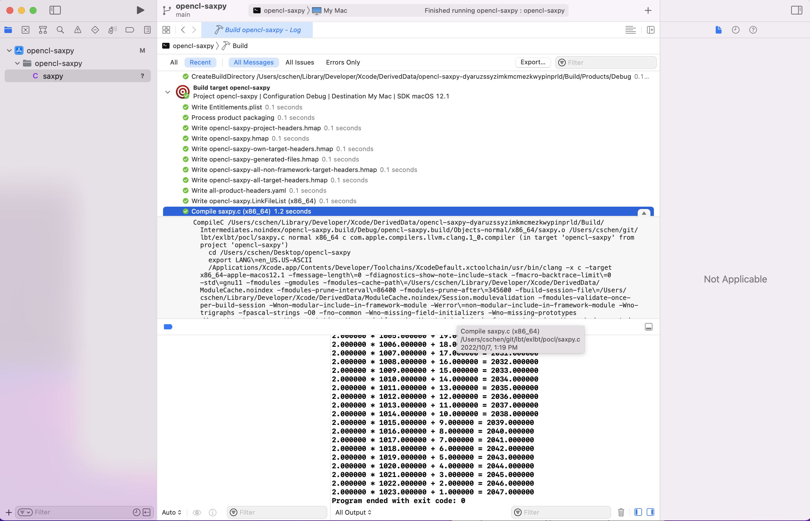

.. _sec-pocl:

Appendix C: POCL
=================

.. contents::
   :local:
   :depth: 4

.. _opencl-f:
.. graphviz:: ../Fig/pocl/opencl.gv

As above figure, one possible HW platform is that one Host + Device with 2 RISCV 
processors and each RISCV has each dedicated memory.

- info::local_mem_type::global -> conherent, CPU cache (SRAM)

- info::local_mem_type::local -> dedicated local memory, GPU cache (SRAM)

OpenCL includes Runtime API, Driver and Compiler three components. 
POCL is an open source implementation for Runtime API.

OpenCL Implementation [#ocl-impl]_.
Wiki OpenCL Open source implementations [#wiki-ocl-osi]_.

OpenCL
------

Builtin-function and builtin-kernel reference here [#builtin-function-kernel]_.
Books [#open-cl-book-heter]_.
Papers [#ocl-acceler-tf]_ [#ocl-agpvldl]_ [#sycl-aesstgplsmlw]_  [#ocl-acpcco]_ 
[#dlc-acs]_ in lbt/papers/pocl.

Run OpenCL
----------

Macos
+++++

~/git/lbt/exlbt/opencl/opencl-saxpy/opencl-saxpy.xcodeproj can be created by 
the following:

Xcode -- Create a new Xcode project -- macOS -- Command Line Tool -- 
Product Name: opencl-saxpy, Language: C -- Next -- Create -- 
"Choose folder ~/git/lbt/exlbt/opencl" -- 
on left opencl-saxpy folder: delete C main -- Move to trash -- 
"copy saxpy.c to ~/git/lbt/exlbt/opencl/opencl-saxpy/opencl-saxpy" -- 
on left opencl-saxpy folder: right click mouse "Add files to "opencl-saxpy"" -- 
save

Build and run saxpy opencl as follows,

Open ~/git/lbt/exlbt/opencl/opencl-saxpy/opencl-saxpy.xcodeproj -- Product -- 
Build -- Product -- Run, then choose the icons of the following 
:numref:`pocl-f1`  and get the compile options and run-result.

.. _pocl-f1:

  Build and run opencl-saxpy.xcodeproj

Open sources
------------

.. table:: Open sources for OpenCL

  ==============  =======  ======  ========  =======
  Project         Runtime  Driver  Compiler  Library
  ==============  =======  ======  ========  =======
  POCL            V        V     
  clang                            V
  libclc                                     V
  ==============  =======  ======  ========  =======

.. table:: Open sources for OpenCL 2

  ==============  ==============  ===================  ===========
  project         Host Compiler   Device Compiler      Device Lib
  ==============  ==============  ===================  ===========
  POCL            X86             X86,ARM,AMD,TCE,PTX  
  clang           X86             NVIDIA-gpu, AMD-gpu  
  libclc                                               Spir, Spir64, NVIDIA-gpu, AMD-gpu
  ==============  ==============  ===================  ===========

libclc is an open source, BSD/MIT dual licensed implementation of 
the library requirements of the OpenCL C programming language [#libclc]_.

POCL
----

Pocl web [#pocl-web]_ and documentation [#pocl-doc]_.

PoCL uses Clang as an OpenCL C frontend and LLVM for kernel compiler implementation, and as a portability layer. Thus, if your desired target has an LLVM backend, it should be able to get OpenCL support easily by using PoCL [#pocl-web]_.

.. note:: OpenCL is C function with keyword __kernel and some attruibutes in data type. If clang is able to compile input.cl to input.ll, then llvm backend can compile input.ll and link to library.

Build as the following bash:

.. rubric:: exlbt/pocl/pocl-install.sh
.. literalinclude:: ../exlbt/pocl/pocl-install.sh

Add apt repo on Ubuntu at first time,

.. code-block:: console

  $ sudo apt-add-repository 'deb https://apt.llvm.org/bionic/   llvm-toolchain-bionic-13 main'
  $ grep "apt.llvm" /etc/apt/sources.list /etc/apt/sources.list.d/*
  /etc/apt/sources.list:deb http://apt.llvm.org/bionic/ llvm-toolchain-bionic-13 main
  /etc/apt/sources.list:# deb-src http://apt.llvm.org/bionic/ llvm-toolchain-bionic-13 main
  /etc/apt/sources.list:deb https://apt.llvm.org/bionic/ llvm-toolchain-bionic-13 main
  /etc/apt/sources.list:# deb-src https://apt.llvm.org/bionic/ llvm-toolchain-bionic-13 main

Reference [#pocl-build]_.

Structure
---------

Code of Runtime in pocl/lib/CL. Test cases of Runtime in pocl/tests/runtime.

GDB on POCL
-----------

After `bash pocl-install.sh`, can run `make check_tier1` but fail on run single 
test such as `./tests/runtime/test_clCreateKernelsInProgram` as follows,

.. code-block:: console

  ~/git/pocl/build$ POCL_DEBUG=all ./tests/runtime/test_clCreateKernelsInProgram
  ...
  [2022-07-15 08:43:44.140733258219579]POCL: in fn pocl_init_devices at line 529:
    |   WARNING |  cschen:Loading /home/cschen/git/pocl/build/lib/CL/pocl/libpocl-devices-basic.so failed: /home/cschen/git/pocl/build/lib/CL/pocl/libpocl-devices-basic.so: cannot open shared object file: No such file or directory
  ...
  [2022-10-06 08:48:06.140725365544843]POCL: in fn pocl_init_devices at line 584:
    |     ERROR | CL_DEVICE_NOT_FOUND no devices found. POCL_DEVICES=(null)
  CL_DEVICE_NOT_FOUND in poclu_get_any_device on line 22

Fail to run single test of executable file is not accpetable for tracing code of 
pocl. Workaround fix as follows,

.. code-block:: console

  ~/git/pocl/build$ touch ../tests/runtime/test_clCreateKernelsInProgram.c
  ~/git/pocl/build$ make VERBOSE=1|grep test_clCreateKernelsInProgram
  ...
  /usr/lib/llvm-13/bin/clang -g  -pie CMakeFiles/test_clCreateKernelsInProgram.dir/test_clCreateKernelsInProgram.c.o -o test_clCreateKernelsInProgram  -Wl,-rpath,/home/cschen/git/pocl/build/lib/CL ../../poclu/libpoclu.a ../../lib/CL/libOpenCL.so.2.9.0 -L/usr/lib/x86_64-linux-gnu -lhwloc /usr/lib/llvm-13/lib/libclang-cpp.so /usr/lib/llvm-13/lib/libLLVM-13.so -lrt -lm -ldl -lm -ldl 

Change link path `rpath` from /home/cschen/git/pocl/build/lib/CL to /usr/local/lib for libpocl-devices-basic.so then PASS as follows,

.. code-block:: console

  ~/git/pocl/build$ cd /home/jonathanchen/git/pocl/build/tests/runtime
  ~/git/pocl/build/tests/runtime$ /usr/lib/llvm-13/bin/clang -g  -pie CMakeFiles/test_clCreateKernelsInProgram.dir/test_clCreateKernelsInProgram.c.o -o test_clCreateKernelsInProgram  -Wl,-rpath,/usr/local/lib ../../poclu/libpoclu.a ../../lib/CL/libOpenCL.so.2.9.0 -lhwloc /usr/lib/llvm-13/lib/libclang-cpp.so /usr/lib/llvm-13/lib/libLLVM-13.so -lrt -lm -ldl -lm -pthread -ldl
  ~/git/pocl/build/tests/runtime$ cd ../..
  ~/git/pocl/build$ ./tests/runtime/test_clCreateKernelsInProgram
  Hello
  World

Then I can use gdb as follows,

.. code-block:: console

  ~/git/pocl/build/$ gdb --args ./tests/runtime/test_clCreateKernelsInProgram
  (gdb) b test_clCreateKernelsInProgram.c:21
  Breakpoint 1 at 0x23b4: file /home/cschen/git/pocl/tests/runtime/test_clCreateKernelsInProgram.c, line 21.
  (gdb) r
  ...
  Breakpoint 1, main (argc=1, argv=0x7fffffffdfa8) at /home/cschen/git/pocl/tests/runtime/test_clCreateKernelsInProgram.c:23
  21        err = poclu_get_any_device(&ctx, &did, &queue);

Examples of Compiling and running on POCL
-----------------------------------------

As tracing clang compilation options in last section, I add compile.sh for running OpenCl program on pocl as follows,

.. rubric:: exlbt/pocl/ex/compile.sh
.. literalinclude:: ../exlbt/pocl/ex/compile.sh

.. code-block:: console

  ~/git/lbt/exlbt/pocl/ex$ POCL_DEBUG=err,warn
  ~/git/lbt/exlbt/pocl/ex$ bash compile.sh
  ~/git/lbt/exlbt/pocl/ex$ ./a.out
  ** Final POCL_DEBUG flags: 18000000000 
  Hello World!
  ~/git/lbt/exlbt/pocl/ex$ POCL_DEBUG=
  ~/git/lbt/exlbt/pocl/ex$ ./a.out 
  Hello World!

References [#pocl-dbg]_.

RISCV OpenCL
------------

In llvm, Mips and Cpu0 can compile .ll file from clang's output for input OpenCL
while RISCV fail on both 14.x and 15.x as follows,

.. code-block:: console

  CodeGenOpenCL % pwd
  $HOME/git/lbt/exlbt/pocl
  % ~/llvm/14.x/llvm-project/build/bin/clang -cc1 -cl-std=CL2.0 -emit-llvm -triple spir-unknown-unknown test.cl
  % ~/llvm/debug/build/bin/llc -march=mips test.ll
  % ~/llvm/test/build/bin/llc -march=cpu0 test.ll
  % ~/llvm/14.x/llvm-project/build/bin/llc -mtriple=riscv64 test.ll
  LLVM ERROR: Unsupported calling convention
  ...
  % ~/llvm/15.x/llvm-project/build/bin/clang -cc1 -cl-std=CL2.0 -emit-llvm -triple spir-unknown-unknown test.cl
  % ~/llvm/15.x/llvm-project/build/bin/llc -mtriple=riscv64 test.ll
  LLVM ERROR: Unsupported calling convention
  ...

  CodeGenOpenCL % pwd
  $HOME/llvm/14.x/llvm-project/clang/test/CodeGenOpenCL
  CodeGenOpenCL % ~/llvm/debug/build/bin/clang -cc1 -cl-std=CL2.0 -emit-llvm -triple spir-unknown-unknown overload.cl
  CodeGenOpenCL % ~/llvm/debug/build/bin/llc -march=mips overload.ll
  CodeGenOpenCL % ~/llvm/test/build/bin/llc -march=cpu0 overload.ll
  CodeGenOpenCL % ~/llvm/14.x/llvm-project/build/bin/llc -mtriple=riscv64 overload.ll
  LLVM ERROR: Unsupported calling convention
  ...

SYCL
----

Webs [#sycl]_. An example [#sycl-wiki]_.

DPC++
-----

Book [#dpcpp-book]_. 

.. rubric:: exlbt/pocl/dpc++.txt

.. [#ocl-impl] https://www.iwocl.org/resources/opencl-implementations/

.. [#wiki-ocl-osi] https://en.wikipedia.org/wiki/OpenCL#Open_source_implementations\

.. [#libclc] https://libclc.llvm.org

.. [#pocl-web] http://portablecl.org/

.. [#pocl-doc] http://portablecl.org/docs/html/

.. [#builtin-function-kernel] http://jonathan2251.github.io/lbt/clang.html#builtin-functions

.. [#open-cl-book-heter] https://dahlan.unimal.ac.id/files/ebooks2/2015%203rd%20Heterogeneous%20Computing%20with%20OpenCL%202.0.pdf

.. [#ocl-acceler-tf] https://mlsys.org/Conferences/doc/2018/84.pdf

.. [#ocl-agpvldl] https://www.researchgate.net/publication/350512301_Automatic_Graph_Partitioning_for_Very_Large-scale_Deep_Learning

.. [#sycl-aesstgplsmlw] https://easychair.org/publications/preprint/GjhX

.. [#ocl-acpcco] https://www.researchgate.net/publication/221084751_A_comprehensive_performance_comparison_of_CUDA_and_OpenCL

.. [#dlc-acs] https://arxiv.org/pdf/2002.03794.pdf

.. [#pocl-build] http://portablecl.org/docs/html/install.html#configure-build

.. [#pocl-dbg] http://portablecl.org/docs/html/debug.html

.. [#sycl] https://www.khronos.org/sycl

.. [#sycl-wiki] https://en.wikipedia.org/wiki/SYCL

.. [#dpcpp-book] https://itbook.store/books/9781484255735
