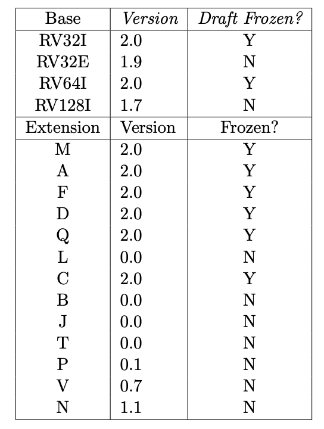
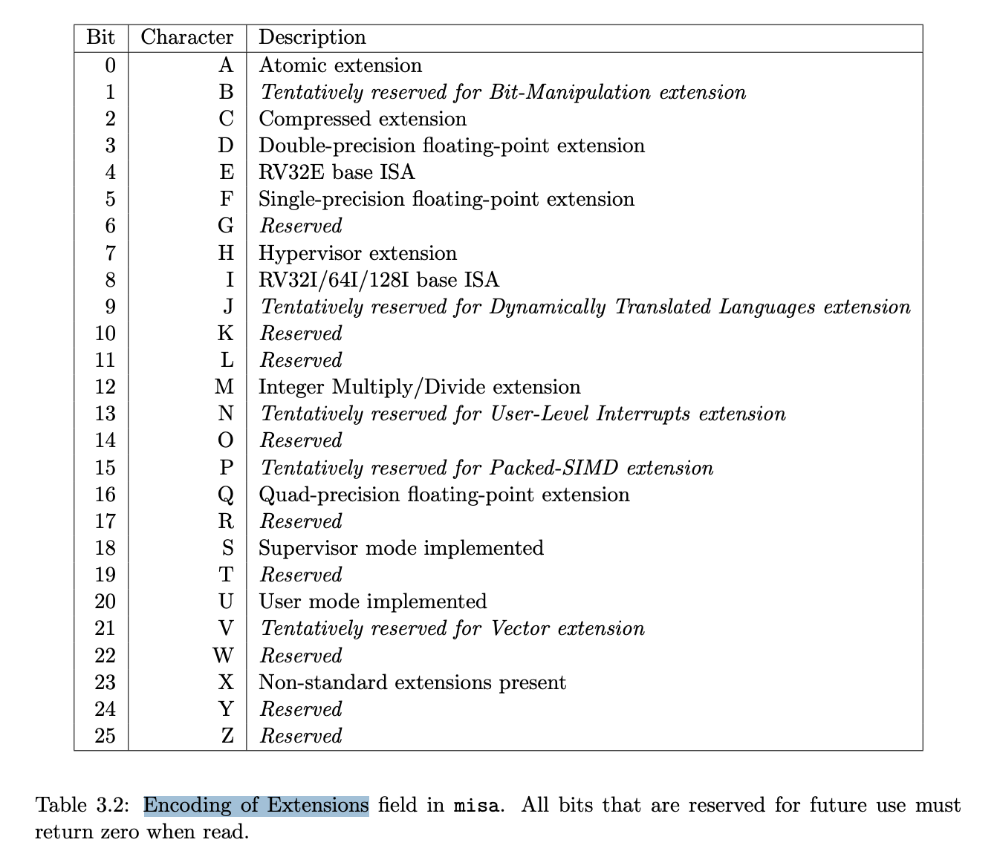
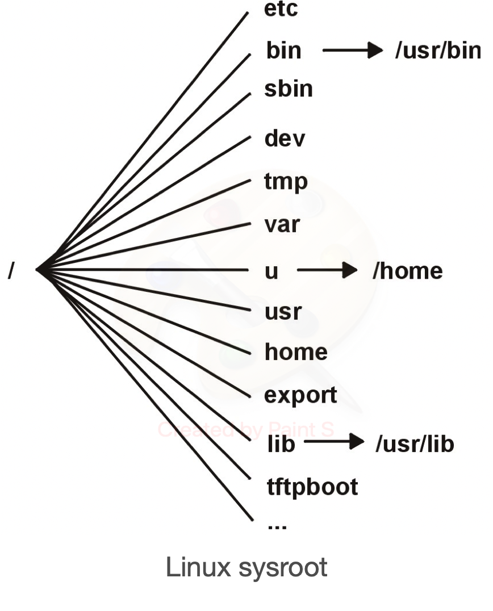

.. _sec-riscv:

Appendix A: RISCV
=================

.. contents::
   :local:
   :depth: 4

This chapter shows the RISC toolchain installatation including gnu, llvm and 
simulators on Linux as figure and table below.

.. _toolchain-f1:
.. graphviz:: ../Fig/riscv/toolchain.gv

.. table:: RISCV toolchain [#toolchain]_

  ==============  ==========================  =============
  Component       name                        github
  ==============  ==========================  =============
  C/C++ Compiler  clang/llvm                  llvm-project
  LLVM Assembler  llvm integrated assembler    "
  LLVM Linker     ld.lld                       "
  debug tool      lldb                         "
  Utils           llvm-ar, llvm-objdump etc.   "
  gcc Assembler   as                          riscv-gnu-toolchain
  gcc Linker      ld.bfd ld.gold               "
  Runtime         libgcc                       "
  Unwinder        libgcc_s                     "
  C library       libc                         "
  C++ library     libsupc++ libstdc++          "
  debug tool      gdb                          "
  Utils           ar, objdump etc.             "
  Functional sim  qemu                        qemu
  Cycle sim       gem5                        gem5
  ==============  ==========================  =============

ISA
---

.. _riscv-f1:

  RISCV ISA

.. _riscv-f2:

  RISCV ISA Description

As above :numref:`riscv-f1` and :numref:`riscv-f2`, RISC has 32/64/128 bit and 
I (integer) is the Base part and the others are optional. G=IMAFD, general 
extensions (i.e., IMAFD)  [#ISA]_ [#RISCV-wiki]_ [#RRE]_.

Since RISCV has vector instruction for variable length of data and allowing 
vendor to encode variable length of instruction set, the little endian is the
dominate format in market [#endians-format]_.

Mem
---

- I-cache, D-cache: Size: 4KB to 64KB in Andes N25f

- ILM, DLM: Size: 4KB to 16MB [#andes-ilm]_

  - For deterministic and efficient program execution
  - Flexible size selection to fit diversified needs

- DRAM

RISC compiler toolchain installatation
--------------------------------------

First, install the depended packages according 
https://github.com/riscv-collab/riscv-gnu-toolchain#readme. 
Next, create your $HOME/riscv and $HOME/riscv/git. Then run the following bash
script.

.. rubric:: exlbt/riscv/riscv-toolchain-setup.sh
.. literalinclude:: ../exlbt/riscv/riscv-toolchain-setup.sh

.. code-block:: console

  $ pwd
  $ $HOME/git/lbt/exlbt/riscv
  $ bash riscv-toolchain-setup.sh

RISCV toolchain includes both baremetal(Newlib) and Linux platform support.

.. code-block:: console

  $ pwd
  $ $HOME/git/lbt/exlbt/riscv
  $ ls $HOME/riscv/riscv_newlib 
  bin  include  lib  libexec  riscv64-unknown-elf  share

.. _riscv-f3:

  RISCV ISA Description

The linux sysroot as :numref:`riscv-f3` above. You can compare it with the following 
installed dirctory.

.. code-block:: console

  $ ls $HOME/riscv/riscv_linux/sysroot/
  etc  lib  lib64  sbin  usr  var
  $ ls $HOME/riscv/riscv_linux/sysroot/usr
  bin  include  lib  libexec  sbin  share

Linker Command
--------------

Different HW platforms have their memory map for their RISCV architecture. As 
result, their HW may need to initialize $sp, $pc and $gp ... . 
GNU linker command language [#ld-cl]_ provides user's memory map to their HW.

The crt0.S and riscv64-virt.ld in lbt/exlbt/riscv modified from origin as follows,

.. code-block:: console

  riscv$ pwd
  ~/git/lbt/exlbt/riscv
  riscv$ diff exlbt/riscv/crt0.S ~/riscv/git/riscv-gnu-toolchain/newlib/libgloss/riscv/crt0.S
  22d21
  <   la sp, __stack_top 
  riscv$ ~/riscv/14.x/riscv_newlib/bin/riscv64-unknown-elf-ld --verbose &> riscv64-virt-origin.ld
  riscv$ diff riscv64-virt-origin.ld riscv64-virt.ld
  1,8d0
  < GNU ld (GNU Binutils) 2.39
  <   Supported emulations:
  <    elf64lriscv
  <    elf32lriscv
  <    elf64briscv
  <    elf32briscv
  < using internal linker script:
  < ==================================================
  16a9,12
  > MEMORY
  > {
  >    RAM (rx)  : ORIGIN = 0x10000, LENGTH = 128M
  > }
  22a19
  >   PROVIDE(__stack_top = ORIGIN(RAM) + LENGTH(RAM));
  257,259d253
  < 
  < 
  < ==================================================
  riscv$ ~/riscv/14.x/riscv_newlib/bin/clang hello.c -menable-experimental-extensions \
  -march=rv64gcv1p0 -O0 -mabi=lp64d -T riscv64-virt.ld -nostartfiles crt0.S -v

If uses RAM (rwx), it has warning and can be removed by `-Wl,--no-warn-rwx-segment`
in clang option.

Qemu on next section can run program without initialzing $sp in crt0.S. Maybe it
is that qemu initialize $sp as in the following code.

.. code-block:: console

  qemu$ pwd
  ~/riscv/git/qemu
  qemu$ vi linux-user/riscv/cpu_loop.c
  void target_cpu_copy_regs(CPUArchState *env, struct target_pt_regs *regs)
  {
    ...
    env->gpr[xSP] = regs->sp;

The ELF object file format uses program headers, which are read by the system 
loader and describe how the program should be loaded into memory. 
The program headers of an ELF file may be displayed using `llvm-objdump -p` 
[#ld-ph]_.

The "la sp, __stack_top" is Psuedo instructions in RISCV [#riscv-pseudo-inst]_.

Qemu simulator
--------------

Install according https://gitlab.com/qemu-project/qemu as follows,

.. code-block:: console

  $ pwd
  $ $HOME/riscv/git
  $ git clone https://gitlab.com/qemu-project/qemu.git
  $ cd qemu
  $ git log
  commit a28498b1f9591e12dcbfdf06dc8f54e15926760e
  ...
  $ mkdir build
  $ cd build
  $ ../configure
  $ make

Then it can compile and run qemu for baremetal as follows,

.. code-block:: console

  $ pwd
  $ $HOME/git/lbt/exlbt/riscv
  $ $HOME/riscv/riscv_newlib/bin/clang -march=rv64g hello.c -fuse-ld=lld \
    -mno-relax -g -mabi=lp64d -o hello_newlib
  $ $HOME/riscv/git/qemu/build/qemu-riscv64 hello_newlib
  hello world!

Linux [#riscv-build-linux]_ as follows,

.. code-block:: console

  $ $HOME/riscv/riscv_linux/bin/clang -march=rv64g hello.c -o hello_linux -static
  $ $HOME/riscv/git/qemu/build/qemu-riscv64 hello_linux
  hello world!

RISCV does need -lm for math.h as follows,

.. rubric:: exlbt/riscv/pow.cpp
.. literalinclude:: ../exlbt/riscv/pow.cpp

The asm for hello world in baremetal as follows,

.. code-block:: console

  $ $HOME/riscv/riscv_newlib/bin/riscv64-unknown-elf-gcc -c hello_world.s
  $ $HOME/riscv/riscv_newlib/bin/riscv64-unknown-elf-ld hello_world.o -o hello_world
  $ $HOME/riscv/git/qemu/build/qemu-riscv64 hello_world
  Hello World

The link for asm and C in baremetal as follows,

.. rubric:: exlbt/riscv/caller_hello.c
.. literalinclude:: ../exlbt/riscv/caller_hello.c

.. rubric:: exlbt/riscv/func_hello_start.s
.. literalinclude:: ../exlbt/riscv/func_hello_start.s

Gem5 simulator
--------------

Build Gem5 according the following,

https://www.gem5.org/documentation/general_docs/building or
http://learning.gem5.org/book/part1/building.html#requirements-for-gem5

If you don't have python3.x-config on Ubuntu 18.04 as follows,

.. code-block:: console

  $ ls /usr/bin/python*
  ... /usr/bin/python2.7-config

Then do install by pip3 as follows [#install-python3-config]_,

.. code-block:: console

  $ sudo apt install python3-pip
  $ pip3 install scons
  $ ls /usr/bin/python*
  ... /usr/bin/python3-config

After install all dependencies, get gem5 and build RISCV as follows,

.. code-block:: console

  $ pwd
  $ $HOME/riscv/git
  $ sudo apt install -y libglib2.0-dev
  $ sudo apt install -y libpixman-1-dev
  $ git clone https://gem5.googlesource.com/public/gem5
  $ cd gem5
  $ git log
  commit 846dcf0ba4eff824c295f06550b8673ff3f31314
  ...
  $HOME/riscv/git/gem5$ /usr/bin/env python3 $(which scons) ./build/RISCV/gem5.debug -j4
  ...
  $ pwd
  $ $HOME/git/lbt/exlbt/riscv
  $ $HOME/riscv/git/gem5/build/RISCV/gem5.debug \
  $HOME/riscv/git/gem5/configs/example/se.py --cmd=./hello_newlib
  **** REAL SIMULATION ****
  build/RISCV/sim/simulate.cc:107: info: Entering event queue @ 0.  Starting simulation...
  hello world!

Check cycles as follows,

.. code-block:: console

  $HOME/git/lbt/exlbt/riscv$ vi m5out/stats.txt
  simSeconds          0.000001       # Number of seconds simulated (Second)
  simTicks            1229000        # Number of ticks simulated (Tick)
  ...

  $HOME/git/lbt/exlbt/riscv$ $HOME/riscv/git/gem5/build/RISCV/gem5.debug \
  /local/git/gem5/configs/example/se.py --cmd=./hello_linux
  ...
  hello world!
  ...

The config of gem5 reference here.
http://learning.gem5.org/book/part1/example_configs.html

GDB
---

.. _gdb-f:
.. graphviz:: ../Fig/riscv/gdb.gv

LLVM 13.x fails on "clang -g" for rvv C/C++ file while LLVM 14.x is work. Run 
qemu on terminal A with gdb on terminal B [#riscv-qemu-gdb]_ as follows,

.. code-block:: console

  // terminal A:
  $ pwd
  $ $HOME/git/lbt/exlbt/riscv
  $ $HOME/riscv/14.x/riscv_newlib/bin/clang vadd1.c -menable-experimental-extensions \
    -march=rv64gcv1p0 -O0 -g -mabi=lp64d -o a.out  -v
  $ $HOME/riscv/git/qemu/build/qemu-riscv64 -cpu rv64,v=true -g 1234 a.out 
  vector version is not specified, use the default value v1.0

  // terminal B:
  $ pwd
  $ $HOME/git/lbt/exlbt/riscv
  $ $HOME/riscv/14.x/riscv_newlib/bin/riscv64-unknown-elf-gdb a.out
  ...
  Reading symbols from a.out...
  (gdb) target remote :1234
  Remote debugging using :1234
  0x0000000000010150 in _start ()
  (gdb) b vadd1.c:95
  Breakpoint 1 at 0x10536: file vadd1.c, line 95.
  (gdb) c
  Continuing.
  Breakpoint 1, main () at vadd1.c:95
  95	  vOp(a, a, a, array_size(a), VMUL);
  (gdb) p a[1]
  $1 = 2

  // terminal A:
  ...
  vl: 32
  array_size(a):4096
  
  a[]: 0 2 4 6 8 10 12 14 16 18 20 22 24 26 28 30 32 34 36 38 40 42 44 46 48 50 
  52 54 56 58 60 62 64 66 68 70 72 74 76 78 80 82 84 86 88 90 92 94 96 98 100 
  102 104 106 108 110 112 114 116 118 120 122 124 126 ...
  The results of VADD:	PASS

  // terminal B:
  $ ...
  (gdb) c

  // terminal A:
  ...
  a[]: 0 4 16 36 64 100 144 196 256 324 400 484 576 676 784 900 1024 1156 1296 
  1444 1600 1764 1936 2116 2304 2500 2704 2916 3136 3364 3600 3844 4096 4356 
  4624 4900 5184 5476 5776 6084 6400 6724 7056 7396 7744 8100 8464 8836 9216 
  9604 10000 10404 10816 11236 11664 12100 12544 12996 13456 13924 14400 14884 
  15376 15876 ...
  The results of VMUL:	PASS
  $ 

Since rvv v1.0 is accepted and v0.10 is draft for release version v1.0, above 
-march change from rv64gv0p10 of llvm 13.x to rv64gcv1p0 llvm 14.x 
[#rvv-0p10-1p0]_.

Beside GDB runs in the same host environment as your program. When you need more 
flexibility--for example, running GDB on a physically separate host, or 
controlling a standalone system over a serial port or a realtime system over a 
TCP/IP connection [#gdb-target]_. To use a TCP connection, use an argument of the 
form host:port. Above "target remote :1234", means host and target run on the same
host listening port 1234 [#gdb-tcpip]_.

RISCV Calling Convention [#calling-conv]_
-------------------------------------------

The rv32: register size 32-bit. The rv64 register size 64-bit.

In RV64, 32-bit types, such as int, are stored in integer registers as proper 
sign extensions of their 32-bit values; that is, bits 63..31 are all equal. 

Two kinds of ABI, ilp32 and lp64, -mabi=ilp32, ilp32f, ilp32d, lp64, lp64f, 
lp64d. The ways of pass float arguments on integer/single-float/double-float.

.. table:: ABI, caller passing integer/float/double arguments [#calling-conv-1]_ [#calling-conv-2]_

  ==============  ==============  =============
  name            float           double
  ==============  ==============  =============
  ilp32/lp64      a registers     a registers
  ilp32f/lp64f    fa registers    a regsiters
  ilp32d/lp64d    fa registers    fa registers
  ==============  ==============  =============

ilp32 and lp64 are Soft-Float Calling Convention.
Soft-Float Calling Convention: Floating-point arguments are passed and returned 
**in integer registers**, using the rules for integer arguments of the same size.

- -mabi=ABI-string

  Specify integer and floating-point calling convention. ABI-string contains 
  two parts: the size of integer types and the registers used for floating-point 
  types. For example ‘-march=rv64ifd -mabi=lp64d’ means that ‘long’ and pointers 
  are 64-bit (implicitly defining ‘int’ to be 32-bit), and that floating-point 
  values up to 64 bits wide are passed in F registers. Contrast this with 
  ‘-march=rv64ifd -mabi=lp64f’, which still allows the compiler to generate code 
  that uses the F and D extensions but only allows floating-point values up to 32 
  bits long to be passed in registers; or ‘-march=rv64ifd -mabi=lp64’, in which 
  no floating-point arguments will be passed in registers.

  The default for this argument is system dependent, users who want a specific 
  calling convention should specify one explicitly. The valid calling conventions 
  are: ‘ilp32’, ‘ilp32f’, ‘ilp32d’, ‘lp64’, ‘lp64f’, and ‘lp64d’. Some calling 
  conventions are impossible to implement on some ISAs: for example, 
  ‘-march=rv32if -mabi=ilp32d’ is invalid because the ABI requires 64-bit values 
  be passed in F registers, but F registers are only 32 bits wide. There is also 
  the ‘ilp32e’ ABI that can only be used with the ‘rv32e’ architecture. This ABI 
  is not well specified at present, and is subject to change [#gnu-riscv-options]_.

RVV
----

Clang/llvm provide RVV (RISC-V Vectors) written in C rather than inline-asm. 
Though it notices as clang option: -target-feature +experimental-v, this way in 
C is shorter, more user-friendly and easy to remember for users than in 
inline-asm form. 
Builtin is C function and friendly either. RVV can be written and run as follows,

.. rubric:: exlbt/riscv/vadd2.c
.. literalinclude:: ../exlbt/riscv/vadd2.c

.. code-block:: console

  $ pwd
  $ $HOME/git/lbt/exlbt/riscv
  $ $HOME/riscv/riscv_newlib/bin/clang vadd2.c -menable-experimental-extensions \
    -march=rv64gcv0p10 -O0 -mllvm --riscv-v-vector-bits-min=256
  $ $HOME/riscv/git/qemu/build/qemu-riscv64 -cpu rv64,v=true a.out
  vector version is not specified, use the default value v1.0
  array_size(a):4096

  a[]: 0 2 4 6 8 10 12 14 16 18 ...
  The results of vadd:	PASS

  a[]: 0 4 8 12 16 20 24 28 32 36 ...
  The results of vadd_asm:	PASS

  $ $HOME/riscv/riscv_newlib/bin/clang vadd1.c -menable-experimental-extensions \
    -march=rv64gcv0p10 -O0 -mllvm --riscv-v-vector-bits-min=256 -static
  $ $HOME/riscv/git/qemu/build/qemu-riscv64 -cpu rv64,v=true a.out
  vector version is not specified, use the default value v1.0
  1 11 11 11 11 11 11 11 11 1 
  $ $HOME/riscv/riscv_newlib/bin/riscv64-unknown-elf-objdump -d a.out|grep vadd.vv
   106fc:	03ae0d57          	vadd.vv	v26,v26,v28

For -march=rv64imfv0p10zfh0p1,

- v0p10: vector version 0.10.

- zfh0p1: "Zfh" 0.1 version [#RRE]_.

For -mabi, as the section above.

Clang/llvm provide builtin and intrinsic functions to implement RVV (RISC-V 
Vectors) 

.. rubric:: $HOME/riscv/git/llvm-project/clang/include/clang/Basic/riscv_vector.td
.. code-block:: c++

  #define vsetvl_e8mf8(avl) __builtin_rvv_vsetvli((size_t)(avl), 0, 5)
  ...
  defm vmadd  : RVVIntTerBuiltinSet;
  ...
  defm vfdiv  : RVVFloatingBinBuiltinSet;

.. rubric:: $HOME/riscv/git/llvm-project/llvm/include/llvm/IR/IntrinsicsRISCV.td
.. code-block:: c++

   def int_riscv_vsetvli   : Intrinsic<...
   ...
   defm vmadd : RISCVTernaryAAXA;
   ...
   defm vfdiv : RISCVBinaryAAX;

Refer to clang/llvm test cases in the following folders.

.. code-block:: console

  $HOME/riscv/git/llvm-project/clang/test/CodeGen/RISCV/rvv-intrinsics$ ls
  ... vfdiv.c ... vfmadd.c

  $HOME/riscv/git/llvm-project/llvm/test/CodeGen/RISCV/rvv$ ls
  ... vfdiv-rv64.ll ... vfmadd-rv64.ll ...

Atomic instructions
-------------------

RISCV atomic instructions [#atomic-isa]_.

Resources
---------

FreeBSD
~~~~~~~

FreeBSD RISCV [#freebsd-platforms]_. FreeBSD [#freebsd]_.

FreeRTOS
~~~~~~~~

Code [#freertos-github-riscv]_ [#freertos-kernel]_. Documents [#freertos-riscv-doc1]_ [#freertos-pdf]_.

Zephyr
~~~~~~

RISCV Boards [#zephyr-riscv]_.

Andes
~~~~~

Amazon-FreeRTOS [#andes-amazon-freertos]_, Xilinux has RISCV inside in MicroZed [#microzed]_ and vivado [#vivado-riscv]_. 

Zephyr [#andes-zephyr]_ .

Websites
--------

https://twilco.github.io/riscv-from-scratch/2019/04/27/riscv-from-scratch-2.html

https://twilco.github.io

To do:
------

As exlbt/riscv/riscv-toolchain-setup-macos-intel.sh. 
Currently, this script complete build on both riscv_newlib and riscv_linux.
However, qemu does not create qemu-riscv64 for baremetal on macos. So cannot
verify it yet.

- How to run qemu-system-riscv64 as baremetal qemu-risv64? Following 
  https://twilco.github.io/riscv-from-scratch/2019/04/27/riscv-from-scratch-2.html#link-it-up
  to create crt0.S and riscv64-virt.ld but not work. It fails without changing 
  crt0.S either.

.. code-block:: console

  // terminal A:
  riscv % ~/riscv/14.x/riscv_newlib/bin/clang hello.c -menable-experimental-extensions \
  -march=rv64gcv1p0 -O0 -mabi=lp64d -T riscv64-virt.ld -Wl,--no-warn-rwx-segment -nostartfiles crt0.S -v
  riscv % ~/riscv/git/qemu/build/qemu-system-riscv64 -machine virt -m 128M -cpu \
  rv64,v=true -gdb tcp::1234 -kernel a.out

  // terminal B:
  riscv % ~/riscv/14.x/riscv_newlib/bin/riscv64-unknown-elf-gdb a.out
  ...
  Reading symbols from a.out...
  (gdb) target remote :1234
  Remote debugging using :1234
  0x0000000080000408 in ?? ()
  (gdb) c
  Continuing.

qemu-system-riscv64 with -nographic fail too.

.. [#toolchain] Reference "Table 1 Toolchain components" of http://jonathan2251.github.io/lbt/about.html#outline-of-chapters

.. [#ISA] https://riscv.org/technical/specifications/

.. [#RISCV-wiki] https://en.wikipedia.org/wiki/RISC-V

.. [#RRE] https://wiki.riscv.org/display/HOME/Recently+Ratified+Extensions

.. [#endians-format] https://www.technicalsourcery.net/posts/on-endianness

.. [#andes-ilm] http://www.andestech.com/en/products-solutions/andescore-processors/riscv-n25f/ ,
    http://www.andestech.com/en/products-solutions/andestar-architecture/

.. [#riscv-qemu-gdb] https://danielmangum.com/posts/risc-v-bytes-qemu-gdb/

.. [#rvv-0p10-1p0] https://github.com/riscv/riscv-v-spec/releases

.. [#gdb-target] https://ftp.gnu.org/old-gnu/Manuals/gdb/html_chapter/gdb_15.html#SEC125

.. [#gdb-tcpip] https://ftp.gnu.org/old-gnu/Manuals/gdb/html_chapter/gdb_15.html#SEC133

.. [#calling-conv] https://riscv.org/wp-content/uploads/2015/01/riscv-calling.pdf

.. [#calling-conv-1] https://blog.csdn.net/zoomdy/article/details/79353313

.. [#calling-conv-2] https://wiki.gentoo.org/wiki/RISC-V_ABIs

.. [#gnu-riscv-options] https://gcc.gnu.org/onlinedocs/gcc/RISC-V-Options.html

.. [#ld-cl] https://ftp.gnu.org/old-gnu/Manuals/ld-2.9.1/html_chapter/ld_3.html

.. [#ld-ph] https://ftp.gnu.org/old-gnu/Manuals/ld-2.9.1/html_chapter/ld_3.html#SEC23

.. [#riscv-pseudo-inst] https://github.com/riscv-non-isa/riscv-asm-manual/blob/master/riscv-asm.md#-a-listing-of-standard-risc-v-pseudoinstructions

.. [#riscv-build-linux] https://github.com/riscv-collab/riscv-gnu-toolchain/issues/644

.. [#install-python3-config] https://www.anycodings.com/questions/gem5-build-fails-with-embedded-python-library-36-or-newer-required-found-2717

.. [#atomic-isa] Chapter 8 of Volume 1, Unprivileged Spec v. 20191213 https://five-embeddev.com/riscv-isa-manual/latest/a.html

.. [#freebsd-platforms] https://www.freebsd.org/platforms/

.. [#freebsd] https://github.com/freebsd

.. [#freertos-github-riscv] In https://github.com/FreeRTOS/FreeRTOS/tree/main/FreeRTOS/Demo, directories RISC-V*

.. [#freertos-kernel] https://github.com/FreeRTOS/FreeRTOS-Kernel.git

.. [#freertos-riscv-doc1] https://www.freertos.org/Using-FreeRTOS-on-RISC-V.html

.. [#freertos-pdf] https://www.freertos.org/fr-content-src/uploads/2018/07/161204_Mastering_the_FreeRTOS_Real_Time_Kernel-A_Hands-On_Tutorial_Guide.pdf

.. [#zephyr-riscv] https://docs.zephyrproject.org/3.1.0/boards/riscv/index.html

.. [#andes-amazon-freertos] https://github.com/andestech/amazon-freertos

.. [#microzed] https://www.xilinx.com/about/blogs/adaptable-advantage-blog/2021/MicroZed-Chronicles--Bluespec-RISC-V.html

.. [#vivado-riscv] https://github.com/eugene-tarassov/vivado-risc-v

.. [#andes-zephyr] Andes Zephyr port supports SMP (Symmetric Multi-Processing) and has been verified on Andes RISC-V multicore. https://www.globenewswire.com/news-release/2021/04/23/2216131/0/en/Andes-Announces-the-New-Upgrade-of-AndeSight-IDE-v5-0-a-comprehensive-software-solution-to-accelerate-RISC-V-AI-and-IoT-developments.html
